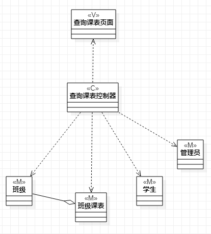
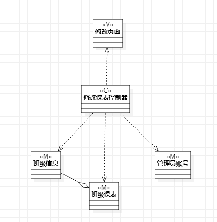

# 实验四：类建模
# 实验五:高级类建模

 ## 一、实验目标

 1. 学习类建模的概念
 2. 理解什么是类，学习类的五种关系
 3. 学习MVC设计模式以及类图的基本画法

 ## 二、实验内容

 1. 学习类及类图的概念
 2. 依据MVC设计模式绘制类图

 ## 三、实验步骤

 1. 观看视频学习类建模知识和MVC设计模式
 2. 观看视频了解类建模实验相关问题
 2. 从实验一的2个用例规约中寻找涉及的相关类
 3. 基于MVC模式分析并确定类之间关系，并设计类图
 4. 在StarUML中画出类图

 ## 四、实验结果

 

 **图1：查询课表的类图**

 

 **图2：修改课表的类图**
