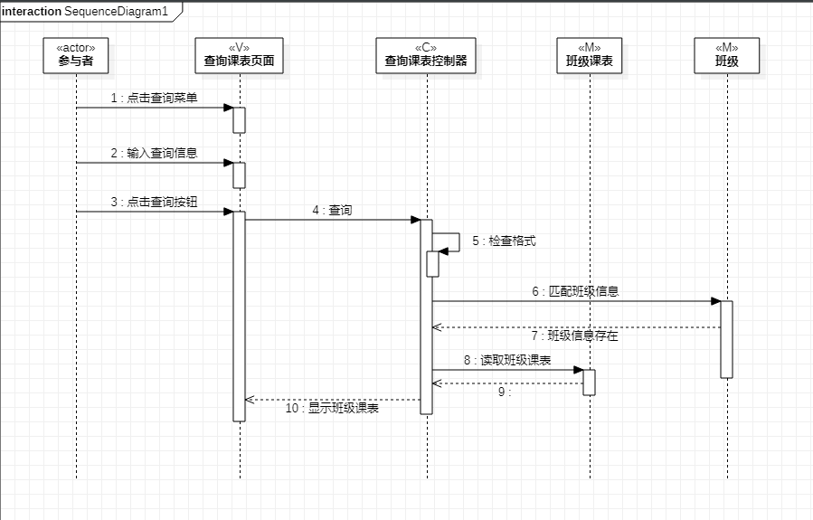
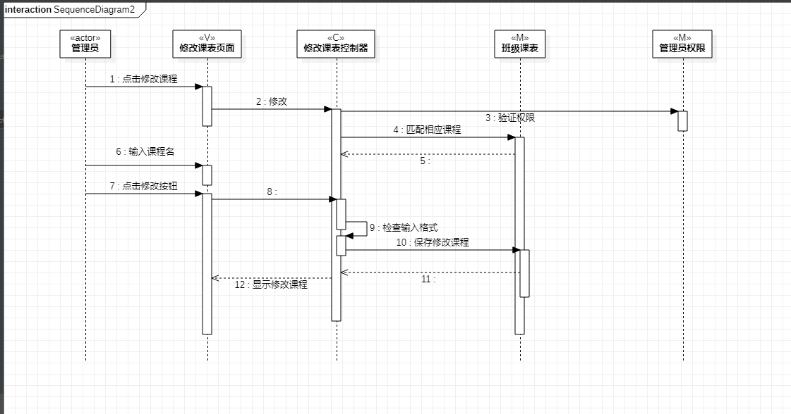

# 实验六：交互建模

 ## 一、实验目标

 1. 理解系统交互的概念。 

 2. 掌握UML顺序图的画法。 

 3. 掌握对象交互的定义与建模方法。 

 ## 二、实验内容

 1. 根据活动图和类图，确定功能所涉及的系统对象。  

 2. 在顺序图上画出参与者。  

 3. 在顺序图上画出消息。 

 ## 三、实验步骤

 1. 根据用例图确定参与者actor  

 2. 根据实验三过程建模、实验二用例建模确定系统对象
 
 3. 根据实验三过程建模、实验二用例建模确定消息和返回消息

 4. 在starUML构建顺序图  
 
 5. 修改实验二修改课表用例图、实验三活动图、实验四类图

 ## 四、实验结果

   
 图1：查询课表顺序图

   
 图2：修改课表顺序图  
