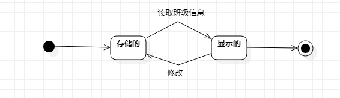

# 实验七：状态建模 

 ### 一、实验目标
  掌握对象状态建模

 ### 二、实验内容
 1. 观看教学视频
 2. 根据用例图、活动图、类图、时序图来绘画状态图  
 3. 编写实验报告文档

 ### 三、实验步骤
 1. 观看教学视频
 2. 绘画状态图
      - 寻找一个最主要的对象   
      - 寻找这个对象所有的状态  
      - 画出状态之间的转变条件 
 3. 编写实验报告

  ### 四、实验结果
     

   图1.课表状态图
