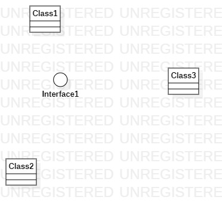

# 实验一

## 实验内容
## 一、实验目标

1. 熟悉GitHub实验过程
2. 安装与使用StarUML

## 二、实验内容

1. 安装GitHub并练习使用Git Bash
2. 安装StarUML并创建一个图

## 三、实验步骤

1. 登录git账号
2. 下载git工具以及StarUML软件
3. 在github上fork项目，clone到本地磁盘
4. 创建自己的学号文件夹及实验文档，用StarUML建立第一个图，导出为图片
5. 用Git Bash把文件夹push到GitHub上
6. 确认内容和照片上传无误后pull request到主仓库

## 四、实验结果

1. 画图

图1.在StarUML上的第一个图
