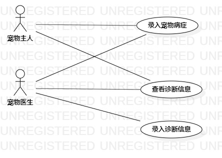

# 实验二：用例建模

## 1.实验目标
1.熟悉UmlStar的软件应用
2.学会运用GitHub做实验

## 2.实验内容
1.建立个人选题，所选应用
2.运用UmlStar为所选系统画用例图
3.学会用git提交实验

## 3.实验步骤
### ①.首先按照实验要求，确立选题，我的是宠物医疗系统
### ②.确立系统的功能
 - 添加宠物病症
 - 添加诊断信息
 - 查看诊断信息
### ③.再根据功能建立Use Case
### ④.确立系统的扮演者
 - 宠物主人
 - 宠物医生
### ⑤.根据扮演者建立Actor
### ⑥.建立关系Association

## 4.实验结果
1.画图：
 
 图1：宠物医疗系统的用例图

## 表1：添加宠物病征用例规约  

用例编号  | UC01 | 备注  
-|:-|-  
用例名称  | 添加宠物病征  |   
前置条件  | 系统进入添加宠物病征页面     |
后置条件  | 系统进入添加诊断信息页面     |
基本流程  | 1.宠物医生选择就诊日期，输入宠物病征，点击保存按钮； |   
~| 2.系统查询宠物信息，检查就诊日期不存在，检查病征为空值，保存病征数据；   |   
~| 3.系统进入添加诊断信息页面。   |  
扩展流程 | 2.1系统检查日期未选择，提示“请选择日期。”|
~ | 2.2系统检查病征未输入，提示“请输入病征。”|
~ | 2.3系统检查就诊日期存在，保存病征数据失败，提示“添加失败，当天已存在病征，请去修改病征。” |

## 表2：添加诊断信息用例规约  

用例编号  | UC02 | 备注  
-|:-|-  
用例名称  | 添加诊断信息  |   
前置条件  | 系统进入添加诊断信息页面     | 
后置条件  | 系统进入宠物信息页面     |
基本流程  | 1.宠物医生选择就诊日期；|
~| 2.系统查询宠物信息，检查存在就诊日期；|
~| 3.系统显示所选就诊日期当天的病征内容；|
~| 4.宠物医生根据病征输入诊断信息，点击保存按钮；  |   
~| 5.系统查询宠物信息，检查存在病征，检查诊断信息为空，保存诊断信息；   |   
~| 6.系统显示宠物信息页面。   |  
扩展流程  | 2.1系统检查不存在就诊日期，提示“该宠物当天未就诊。” |
~| 5.1系统检查诊断信息不为空，保存诊断信息失败，提示“添加失败，该宠物已存在诊断信息，请修改诊断信息。”   |
~| 5.2系统检查诊断信息未输入，提示“请输入诊断信息。” |

## 表3：查看诊断信息用例规约  

用例编号  | UC03 | 备注  
-|:-|-  
用例名称  | 查看诊断信息  |   
前置条件  | 系统进入宠物信息页面     | 
后置条件  | 系统进入诊断信息页面     |
基本流程  | 1.用户选择就诊日期，点击查看诊断信息按钮；  |
~| 2.系统查询宠物信息，检查存在就诊日期，检查存在诊断信息；  |   
~| 3.系统显示诊断信息页面。   |
扩展流程  | 2.1系统检查不存在就诊日期，提示“该宠物当天未就诊。”|
~| 2.2系统检查不存在诊断信息，提示“该宠物还未添加诊断信息”。   |
