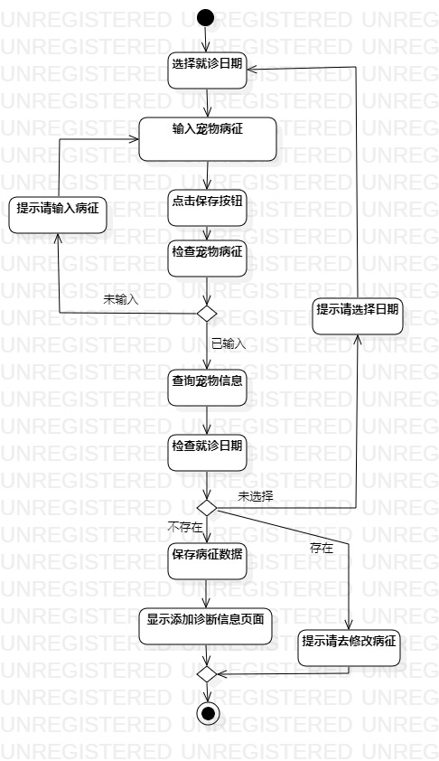
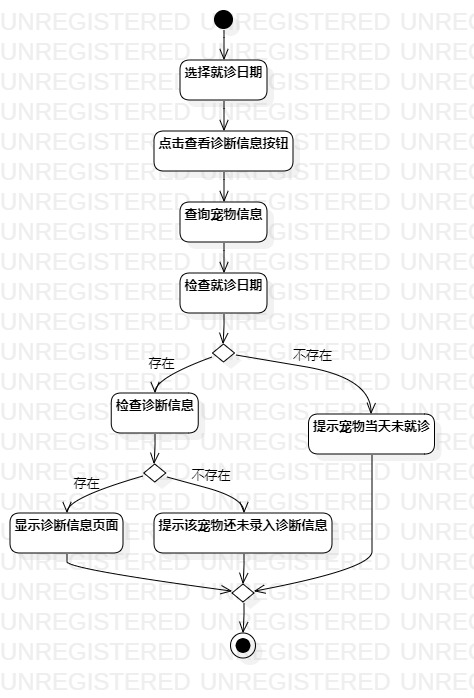

# 实验三：过程建模

## 1.实验目标

1. 掌握过程建模方法
2. 掌握活动图的画法（Activity Diagram）

## 2.实验内容

 - 根据实验二中的用例规约创建活动图

## 3.实验步骤

1. 首先了解用例图中的各个图标的用处，确定注意事项（如果有并发事件需用到实线标明）;  
2. 根据实验二中的用例规约创建三张活动图（添加宠物病征的活动图、添加诊断信息的活动图、查询诊断信息的活动图）;  
3. 打开用例图创建开始Initial和结束Final;  
4. 根据用例的流程创建活动Action;  
5. 当遇到系统操作有扩展流程时，创建分支Decision，列明分支条件，创建合并Merge，表明软件运行的结果指向;  
6. 再根据条件创建活动Action（执行条件之后的结果）;  
7. 再创建线条Control Flow连接活动，表明它们之间的执行关系;  
8. 最后编写实验报告并提交;  

## 4.实验结果

  
图1：添加宠物病征的活动图

  
图2：添加诊断信息的活动图

  
图3：查看诊断信息的活动图
