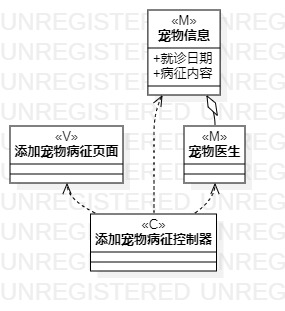
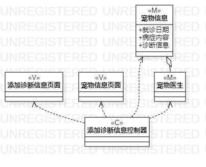
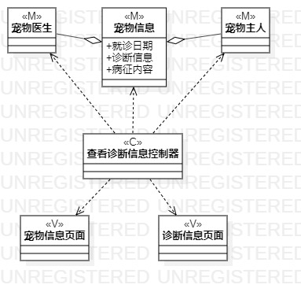

# 实验四：类建模
# 实验五：高级类建模

## 1.实验目标

1. 掌握类建模方法；
2. 了解MVC或你熟悉的设计模式；
3. 掌握类图的画法。（Class Diagram）
4. 理解类的5种关系；
5. 掌握类之间关系的画法。（Class Diagram）

## 2.实验内容

 - 根据实验二中的用例规约进行画类图
  1. 添加宠物病征的类图
  2. 添加诊断信息的类图
  3. 查询诊断信息的类图

## 3.实验步骤

1. 首先了解类图中各种符号的用法;  
2. 根据实验二中的用例规约创建三张类图（添加宠物病征的类图、添加诊断信息的类图、查询诊断信息的类图）;  
3. 打开用例图创建Model、View和Control;   
4. 再根据mvc模式创建他们之间的依赖关系dependence还有包含关系aggregation;  
5. 最后编写实验报告并提交;  

## 4.实验结果

  
图1：添加宠物病征的类图

  
图2：添加诊断信息的类图

  
图3：查看诊断信息的类图
