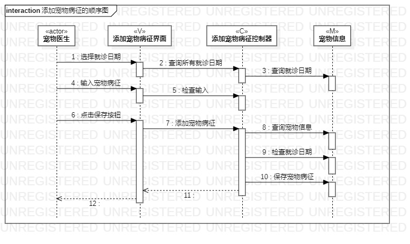
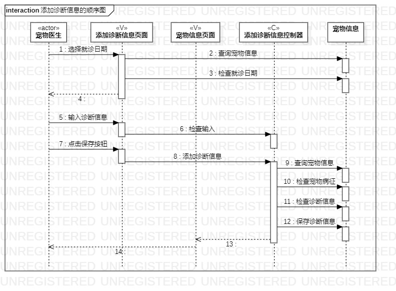

# 实验六：交互建模

## 1.实验目标

1. 理解系统交互；
2. 掌握UML顺序图的画法；
3. 掌握对象交互的定义与建模方法。

## 2.实验内容

  1. 根据用例模型和类模型，确定功能所涉及的系统对象；
  2. 在顺序图上画出参与者（对象）；
  3. 在顺序图上画出消息（交互）。

## 3.实验步骤

1. 首先了解顺序图中各种符号的用法;  
2. 根据实验二中的用例规约创建三张顺序图（添加宠物病征的顺序图、添加诊断信息的顺序图、查看诊断信息的顺序图）;  
3. 根据实验五、六类建模和高级类建模创建顺序图中的角色actor、界面view、控制器control、还有类model。  
4. 再根据系统执行的顺序创建系统的脉络。 
5. 最后编写实验报告并提交;  

## 4.实验结果

  
图1：添加宠物病征的顺序图

  
图2：添加诊断信息的顺序图

  
图3：查看诊断信息的顺序图
