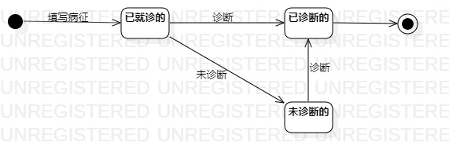

# 实验七：状态建模

## 1.实验目标

1. 掌握对象状态建模（状态图，Statechart）。

## 2.实验内容

  1. 根据用例模型和类模型，创建状态图；
  2. 完成状态建模并编写实验报告；

## 3.实验步骤

1. 首先了解顺序图中各种符号的用法;  
2. 根据用例模型和类模型，寻找一个关键的对象；
3. 在状态图上设计该对象的关键状态；
4. 根据用例模型设计状态之间的转变条件。
5. 最后编写实验报告并提交;  

## 4.实验结果

  
图1：宠物信息的状态图