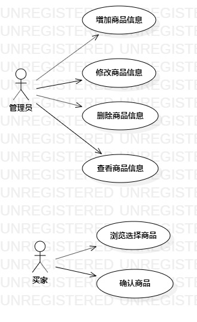

# 实验二

## 1、实验目标
1. 熟悉GitHub实验过程
2. 创建并完善选题

## 2、实验内容
1. 提交选题
2. 说明选题功能需求
3. 画用例图
4. 编写用例规约

## 3、实验步骤
1. 确定选题：#209 B2C购物车系统
2. 完善功能描述:  
(1) 管理员可以管理商品信息，包括增加商品信息，修改商品信息，删除商品信息，查看商品信息。  
(2) 买家可以到平台购买商品，选好的商品进入购物车。  
(3) 在购物车里买家确认自己的商品，不买可以撤销商品。
3. 绘画用例图
4. 编写用例规约

## 4、实验结果

图1:B2C购物车系统的用例图

## 表1：浏览选择商品用例规约  

用例编号  | UC01 | 备注  
-|:-|-  
用例名称  | 浏览选择商品  |   
前置条件  | 买家进入商品页面   | *可选*   
后置条件  | 买家进入购物车页面   | *可选*   
基本流程  | 1. 买家在商品页面选择商品，系统会显示商品库存信息；  |*用例执行成功的步骤*    
~| 2. 买家根据所需要的商品点击按钮，系统将其添加到购物车；  |   
~| 3. 买家选择好商品后进入购物车页面  |      
扩展流程  | 1. 系统发现买家所购商品库存不足，提示买家“库存不足”信息。 |*用例执行失败* 

## 表2：确认商品用例规约  

用例编号  | UC02 | 备注  
-|:-|-  
用例名称  | 确认商品  |   
前置条件  | 买家进入购物车页面   | *可选*   
后置条件  | 买家进入商品页面   | *可选*   
基本流程  | 1. 买家在购物车页面再次确认商品；  |*用例执行成功的步骤*    
~| 2. 买家不想购买可以在购物车里清空商品；  |   
~| 3. 买家如还想购买商品可以返回到商品页面进行购买； |      
扩展流程  | 1. 系统发现购物车里没有商品，提示买家“购物车没有商品”信息。 |*用例执行失败* 
