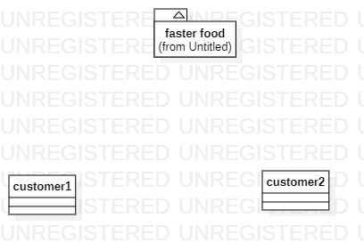

# 实验一

## 实验目标
1. 搭建好课程要求的相关环境
2. 下载实验软件，并制作出第一张图

## 实验内容
1. 下载并安装建模工具 StarUML，下载地址：http://staruml.io
2. 确定个人建模选题，将选题填写在 Issues 中：https://github.com/hzuapps/uml-modeling-2020/issues

## 实验结果

图1.在StarUML上创建的第一个图
