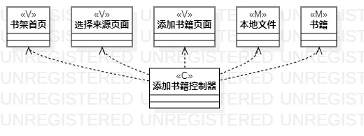
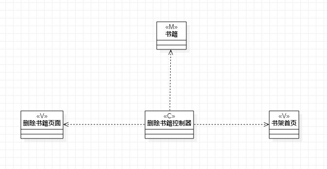
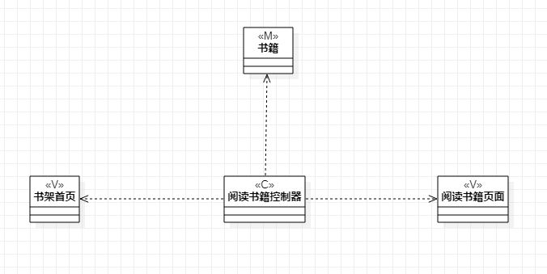

# 实验四五

## 一、实验目标
- 掌握类建模方法
- 了解MVC
- 掌握类图的画法

## 二、实验内容

- 基于MVC模式设计类
- 画出类图
- 画出类之间的关系

## 实验步骤

- 根据MVC设计类
- 画出（model）
- 画出（controller）
- 画出（view）
- 画出类之间的关系

## 实验结果

图1.添加书籍类图

图2.删除书籍类图

图3.阅读书籍类图
