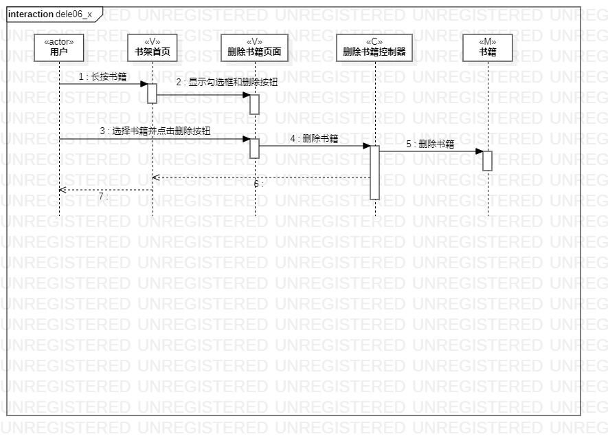
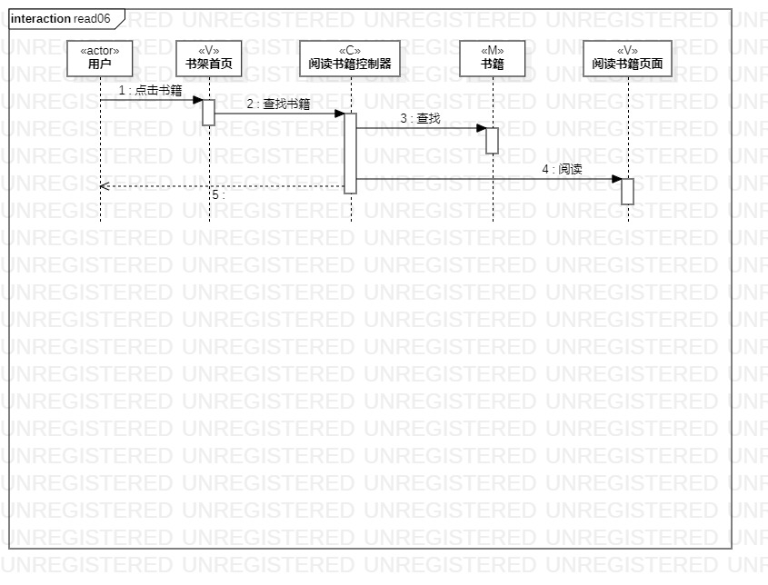

# 实验六

## 一、实验目标

- 学习系统交互
- 掌握UML顺序图的画法

## 二、实验内容

- 根据活动图和类图确定参与者
- 在顺序图上画出参与者
- 画出消息

## 三、实验步骤

- 观看教学视频
- 根据自己的活动图和类图确定所有参与者
- 选择相关参与者画出添加书籍顺序图
- 选择相关参与者画出删除书籍顺序图
- 选择相关参与者画出阅读书籍顺序图

## 四、实验结果

图1.添加书籍的顺序图

图2.删除书籍的顺序图

图3.阅读书籍的顺序图
