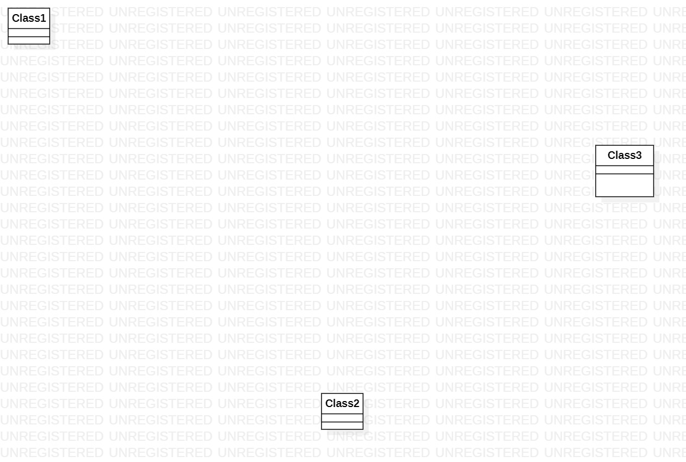

# 实验一

## 实验目标

# 下载StarUML和Git

# 注册git账号

# 确认选题及其功能要求

# 建立第一个UML模型图

# 使用git上传本地使用文件

# 在GitHup将git上的文件发送至老师账号

## 实验内容

## 选题标题：酒店客房管理系统

## 功能需求

# 题目数据库建立，按不同类型的房间

# 功能1：分类管理

# 功能2：增、删、改、查。
