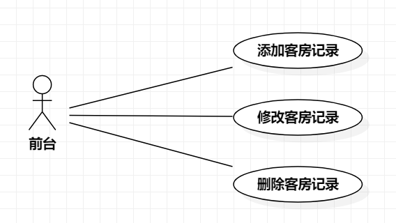

# 实验二：用例建模 

## 1.实验目标
- 了解用例图中各元素之间的关系
- 学会根据自己的题目画出用例图
## 2.实验内容
- 确定选题
- 在StarUML中画出用例图
- 编写实验报告
## 3.实验步骤
- 确定选题
- 根据选题在staruml画出用例图
- 提取用例图，编写实验报告
- 编写用例规约
## 4.实验结果

图1 实验二用例图

## 5.用例规约
## 表1：入住用例规约

用例编号  | 00 | 备注  
-|:-|-  
用例名称  | 入住  |   
前置条件  | 前台登陆客房管理系统     | *可选*   
后置条件  | 前台返回系统主界面     | *可选*   
基本流程  | 1.前台点击客户入住按钮  |*用例执行成功的步骤*    
~| 2.系统进入入住记录界面  |   
~| 3.前台录入客户、客房信息，点击保存   |   
~| 4.系统检测，此类房间空余，添加客户入住记录   |   
~| 5.添加成功，返回系统主界面   |  
扩展流程  | 4.1系统检测此类房间暂无空余，提示“添加失败，此类房间暂无空余”   |*用例执行失败*    
~| 4.2添加失败，返回系统主界面   |  

## 表2：退房用例规约

用例编号  | 01 | 备注  
-|:-|-  
用例名称  | 退房  |   
前置条件  | 前台登陆客房管理系统     | *可选*   
后置条件  | 前台返回系统主界面     | *可选*   
基本流程  | 1.前台确定目标客户入住记录，点击删除按钮  |*用例执行成功的步骤*    
~| 2.系统提示“请输入安全密码”  |   
~| 3.前台输入安全密码，点击确认按钮   |   
~| 4.系统检测，密码正确，删除客户入住记录   |   
~| 5.删除成功，返回系统主界面   |  
扩展流程  | 4.1系统检测安全密码错误，提示“密码错误”  |*用例执行失败*    
~| 4.2删除失败，返回系统主界面   |  

## 表3：换房用例规约

用例编号  | 02 | 备注  
-|:-|-  
用例名称  | 换房  |   
前置条件  | 前台登陆客房管理系统     | *可选*   
后置条件  | 前台返回系统主界面     | *可选*   
基本流程  | 1.前台确定目标客户入住记录，点击修改按钮  |*用例执行成功的步骤*    
~| 2.系统进入修改记录界面  |   
~| 3.前台修改客户、客房信息，点击保存   |   
~| 4.系统检测，目标类房间空余，修改客户入住记录   |   
~| 5.修改成功，返回系统主界面   |  
扩展流程  | 4.1系统检测目标类房间暂无空余，提示“修改失败，此类房间暂无空余”   |*用例执行失败*    
~| 4.2修改失败，返回系统主界面   |  
