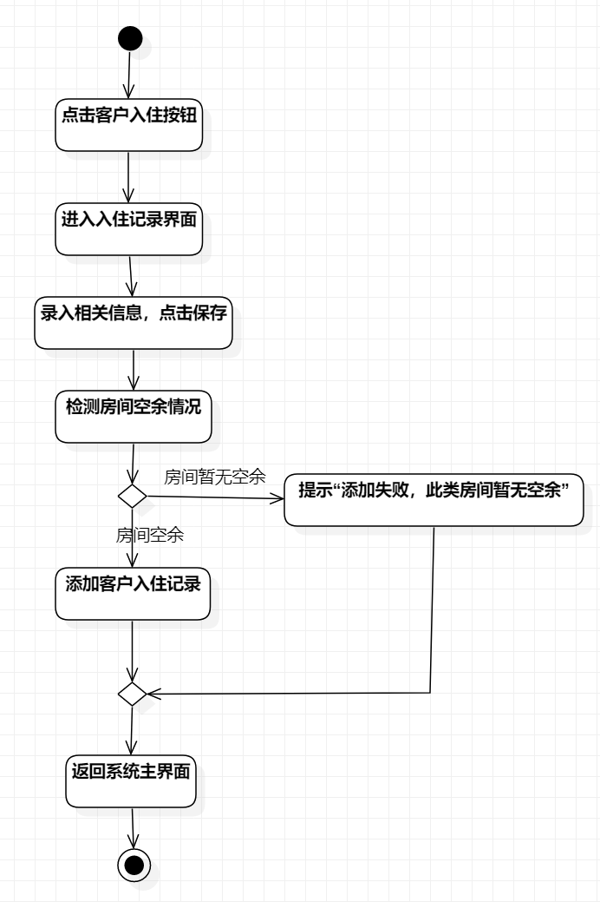
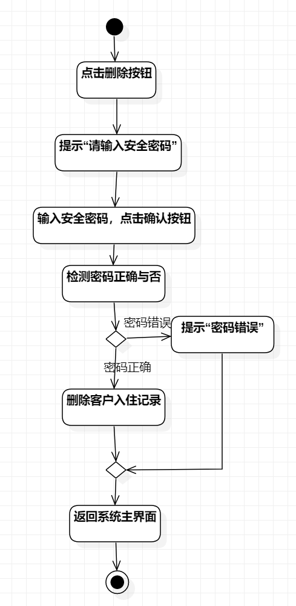
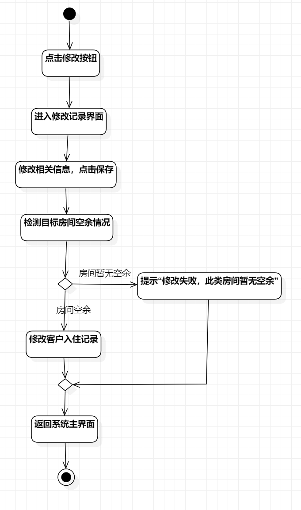

# 实验三：过程建模

## 一、实验目标

1、了解过程建模的基础知识

2、掌握活动图的画法

## 二、实验内容

1、看视频，了解过程建模的相关知识

2、运用StarUML绘制实验二用例规约的活动图

## 三、实验步骤

1、观看视频，了解过程建模的相关知识，学习运用StarUML绘制活动图

2、观看视频，了解注意事项

3、参照用例规约，绘制活动图，并更改用例规约

## 四、实验结果

### 活动图如下：

图1：入住的活动图

图2：退房的活动图

图3：换房的活动图
