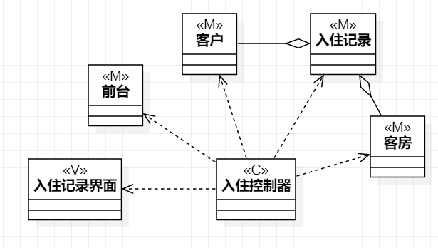
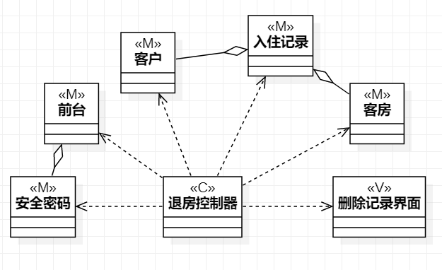
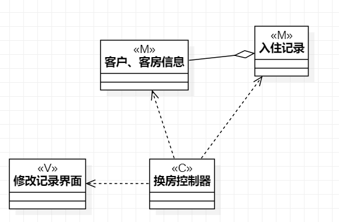

# 实验四、五：类建模
## 一、实验目标 
1. 掌握类建模方法
2. 了解MVC或你熟悉的设计模式
3. 掌握类图的画法
## 二.实验内容
 - 根据实验二中的用例规约画相关类图
  1. 入住用例的类图
  2. 退房用例的类图
  3. 换房用例的类图
## 二、实验步骤
1. 观看实验教程视频与问题讲解
2. 根据用例规约找出必要的类
3. 新建相关类图
4. 用线连接各个类
    - 依赖Dependency（虚线箭头）
    - 关联Association（实线）
    - 聚合Aggregation（实线空心棱形）
    - 组合Composition（实线实心棱形）
    - 继承Inheritance（实线空心三角形）
## 三、实验结果
  
图1：入住用例的类图  

  
图2：退房用例的类图  

  
图3：换房用例的类图  
