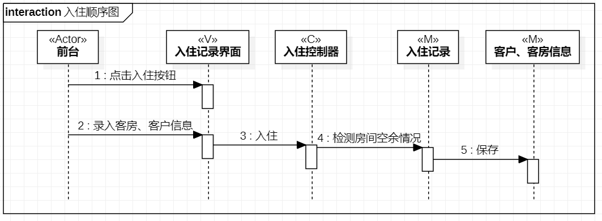
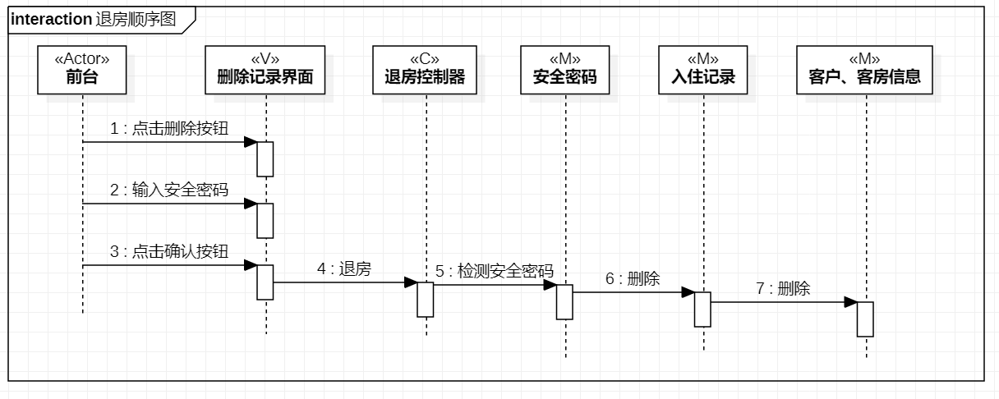
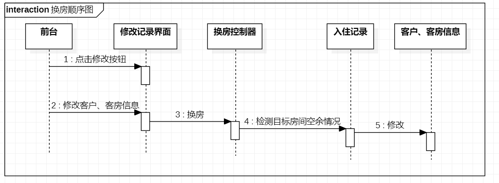

# 实验六：交互建模

## 一、实验目标

1. 理解系统交互。 

2. 掌握UML顺序图的画法。 

3. 掌握对象交互的定义与建模方法。 

## 二、实验内容

1. 根据用例模型和类模型，确定功能所涉及的系统对象。  

2. 在顺序图上画出参与者。  

3. 在顺序图上画出目标之间的联系。 

## 三、实验步骤

1. 按学习通规定顺序观看视频  

2. 类模型，用例模型画顺序图 

3.写实验报告lab6.md

## 四、实验结果

  
图1：入住顺序图

  
图2：退房顺序图  

  
图3：换房顺序图  
