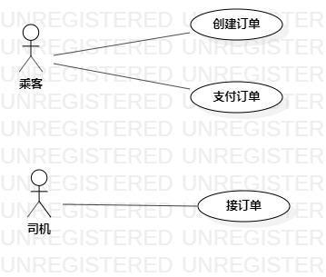

# 实验二：用例建模

## 一. 实验目标
1. 细化选题
2. 学习使用StarUML用例建模
3. 学习如何编写用例规约

## 二、实验内容

1. 创建用例图
2. 编写实验报告文档
3. 编写用例规约

## 三、实验步骤

1. 确定选题：#427 网约车平台

2. 根据选题创建用例图（Lab2_UseCaseDiagram）

3. 确定参与者（Actor）: 
    - 乘客
    - 司机

4. 确定用例（UserCase）:   
      - 乘客创建订单
      - 乘客支付订单
      - 司机接订单

5. 建立Actor和UserCase之间的联系

6. 画用例图（Lab2_UseCaseDiagram）

7. 根据用例图编写用例规约

## 四、实验结果

1. 项目用例图

  
图1. 项目用例图

## 表1：创建订单用例规约  

用例编号  | UC01 | 备注  
-|:-|-  
用例名称  | 创建订单  |   
前置条件  |  乘客已进入创建订单界面  |   
后置条件  | 显示订单详情页面     |   
基本流程| 1. 乘客选择出发地和目的地并填写乘车人数；  |   *用例执行成功的步骤*  
~| 2. 系统计算并显示打车费用；  |   
~| 3. 乘客点击确认按钮；  |  
~| 4. 系统检查订单信息无错误；  |  
~| 5. 系统保存订单信息；  |  
~| 6. 系统显示创建成功。  |  
扩展流程  | 4.1 系统检查发现乘车人数、出发地、目的地其一为空，提示出发地、目的地、乘车人数皆不能为空； |*用例执行失败*  
~  | 4.2 系统检查发现乘车人数大于标准乘车人数，提示乘车人数最多为4人。 | 

## 表2：支付订单用例规约  

用例编号  | UC02 | 备注  
-|:-|-  
用例名称  | 支付订单  |   
前置条件  |  乘客已登录且存在未支付订单；  |   
后置条件  | 显示订单详情页面；     |   
基本流程  | 1. 乘客点击支付订单按钮；  |*用例执行成功的步骤*    
~| 2. 系统查询乘客账户；
~| 3. 检查乘客账户余额大于打车费用；  |
~| 4. 系统减去打车费用；  |      
~| 5. 系统更新乘客账户余额，修改订单为已支付状态；  |   
~| 6. 系统显示支付成功。  |   
扩展流程  | 3.1 系统检查发现乘客账户余额小于打车费用，提示乘客“账户余额不足”。 |*用例执行失败*  

## 表3：接订单用例规约  

用例编号  | UC03 | 备注  
-|:-|-  
用例名称  | 接订单  |   
前置条件  |  司机已登录、认证且存在可接订单  | 
后置条件  | 显示接单成功页面     |   
基本流程  | 1. 司机点击接单按钮；  |*用例执行成功的步骤*    
~| 2. 系统查询订单信息；  |   
~| 3. 系统检查订单状态可接；  |   
~| 4. 系统修改订单为已接状态；  |  
~| 5. 系统显示接单成功。  |   
扩展流程  | 3.1 系统检查发现订单状态为不可接，提示“当前订单已被接”。 |*用例执行失败*  