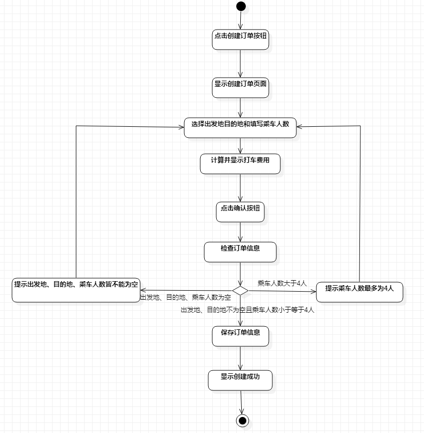
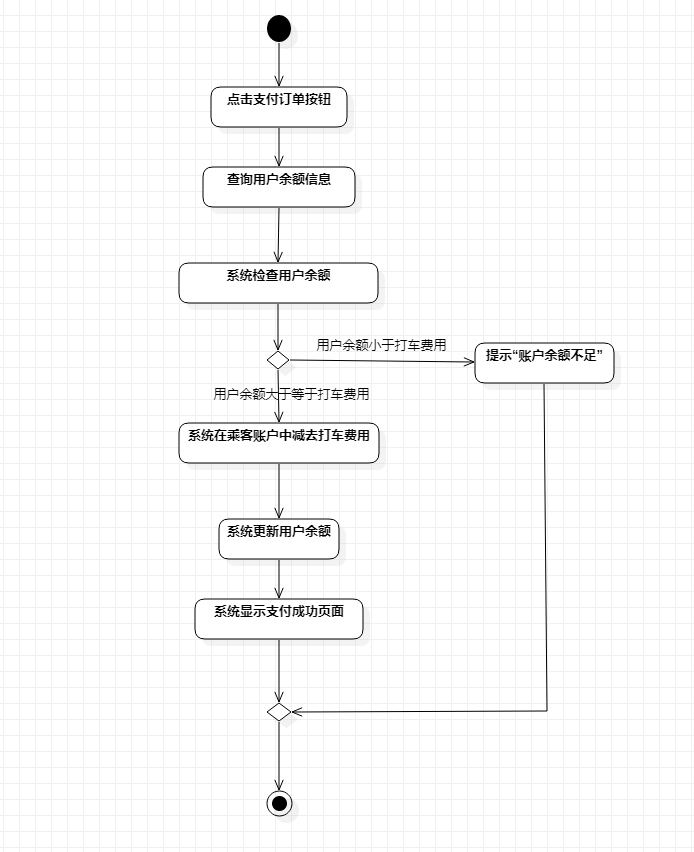
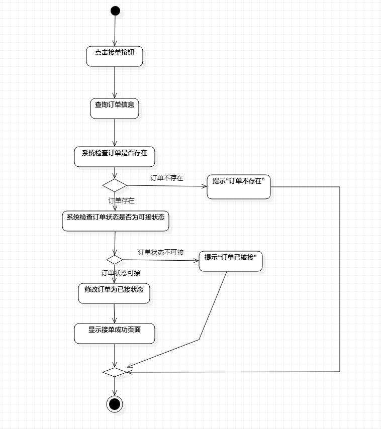

# 实验三：过程建模 

## 一. 实验目标
1. 掌握过程建模方法；
2. 掌握活动图的画法。（Activity Diagram）

## 二、实验内容

1. 根据用例图创建活动图
2. 编写实验报告文档

## 三、实验步骤

1. 详细比较原来的用例图
2. 在活动图中画出开始与结束
3. 将用例图的基本流程转换为活动图的动作
4. 找出决策的关键点，例如创建订单中的检查订单信息
5. 根据决策的策略画出下一步的动作
6. 在画图的过程中思索用例图的用例规约是否恰当
7. 完成活动图并且修改用例规约

## 四、实验结果

1. 项目活动图

  
图1. 创建订单活动图

  
图2. 支付订单活动图

  
图3. 接订单活动图

