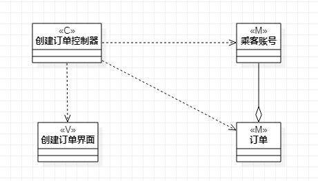
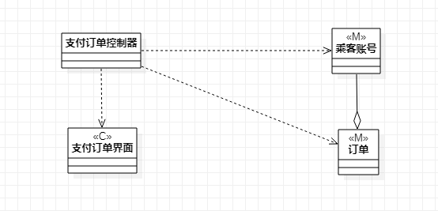
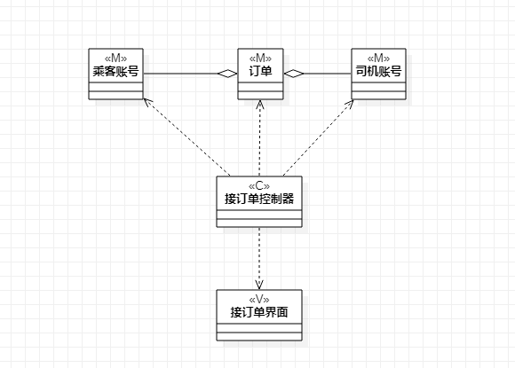

# 实验四、五：类建模

## 一. 实验目标
1. 掌握类建模方法；
2. 了解MVC或你熟悉的设计模式；
3. 掌握类图的画法。（Class Diagram）

## 二、实验内容

1. 基于MVC模式设计类；
2. 设计类的关系；
3. 画出类图。

## 三、实验步骤

1. 分析自己的用例能否使用MVC设计模式实现
2. 从用例图和活动图中抽象数据对象形成Model
3. 找出已有的界面
4. 分析每一个类之间的关系，是依赖还是聚合等
5. 连接Model、View和Controller

## 四、实验结果

  
图1. 创建订单的类图

  
图2. 支付订单的类图

  
图3. 接订单的类图

