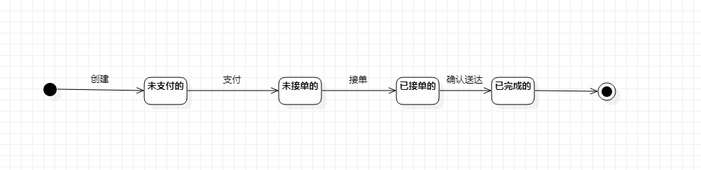

# 实验七：状态建模

## 一、实验目标

1. 掌握对象状态建模（状态图，Statechart）

## 二、实验内容

- 寻找一个关键的对象；
- 设计该对象的关键状态；
- 找到该状态的转变条件。

## 三、实验步骤

1. 根据自己的用例图、用例规约、活动图、类图、顺序图，选择订单作为关键的对象；

2. 找出订单的相关状态（未支付的，未接单的，已接单的，已完成的），订单的开始状态为未支付的，乘客支付后变为未接单的，司机接单后变为已接单的，司机确认送达后变为已完成的

3. 添加“Initial State”、“Final State”、“Simple State”，然后用连线连起来

## 四、实验结果

### 1. 订单状态图

图1. 订单状态图