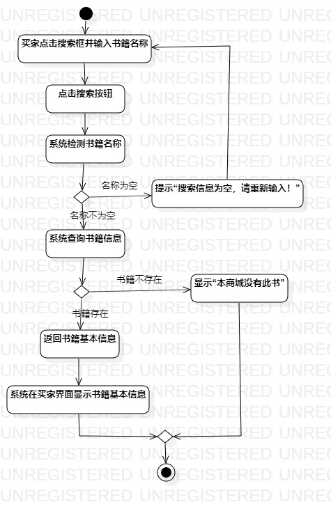
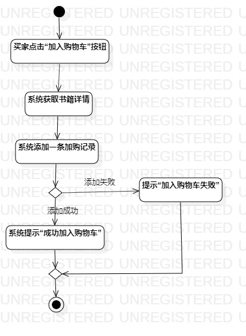
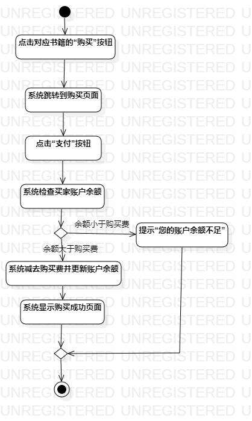

# 实验三：过程建模

## 一、实验目标

1. 理解活动用例元素
2. 掌握过程建模方法
3. 掌握活动图（Activity Diagram）的画法

## 二、实验内容

1. 学习活动图的概念和组成
2. 根据lab2中编写的用例规约画活动图

## 三、实验步骤

1. 观看老师所发实验视频

2. 在StarUML新建活动图

3. 根据用例规约画活动图

4. 将绘制的活动图导出为图片

5. 编写Lab3实验报告

## 四、实验结果

### 项目活动图

  
图1：搜索图书的活动图

  
图2：加购图书的活动图

  
图3：购买图书的活动图
## 五、实验心得

  本次实验，最大的收获还是认识了什么是活动图，通过观看老师的视频，学会了如何画出一个完整的活动图。其次，在绘制活动图中
  ，发现自己的用例规约仍有修改的地方，通过一步步修改，在修改中完善自己的项目，对自己要做什么有了更清晰的认识。