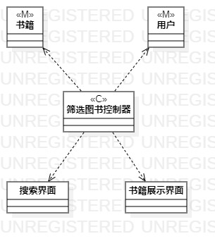
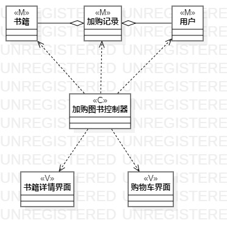
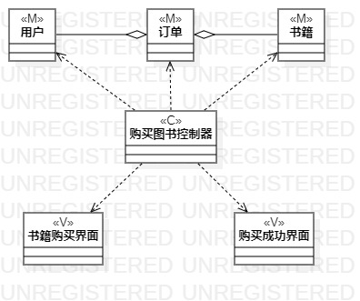

# 实验4&5名称：类建模&高级类建模

## 一、实验目标
  1.掌握类的概念
	
  2.掌握类建模的方法
	
  3.了解MVC设计模式
	
  4.学习类图的画法
## 二、实验内容

   1. 学习类图的知识
   
   2. 根据用例规约画出相应的类图
   
   3. 编写实验报告
## 三、实验步骤
#### 1. 观看老师的视频，学习类图的知识

#### 2. 根据用例规约确定要创建的类图

  1）搜索图书类图
  
  2）加购图书类图
  
  3）购买图书类图
	  
#### 3. 为每个类图确定具体的类

  3.1 搜索图书类图： 
  - Model：书籍类
  - Controller：搜索图书控制器
  - View：搜索界面和书籍展示界面
    
  3.2 加购图书类图：
  - Model：包括书籍类、加购记录类，其中加购记录包含有书籍信息
  - Controller：加购图书控制器
  - View：书籍详情界面和购物车界面 
    
  3.3 购买图书类图：
  - Model：包括用户类、订单类、书籍类，其中订单包含书籍信息和用户信息
  - Controller：购买图书控制器
  - View：书籍购买界面 
		
#### 4.根据mvc设计模式确定类的关系

#### 5.画出对应的类图

## 四、实验结果

#### 图书商城的类图 

  
图1 搜索图书类图

  
图2 加购图书类图

  
图3 购买图书类图