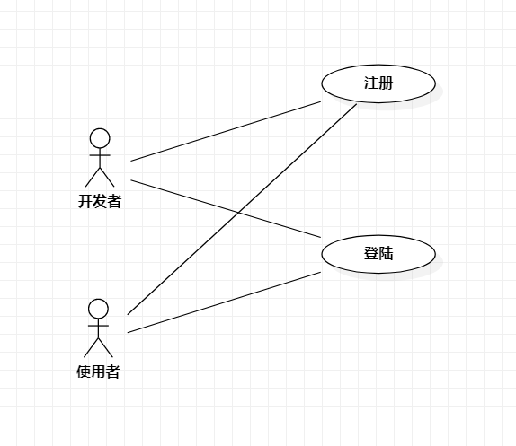
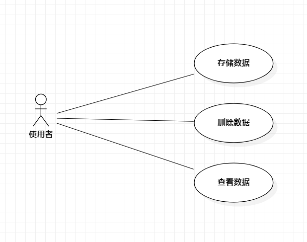

# 实验2：用例建模

## 1.实验目标
- 使用Markdown编写报告
- 细化选题
- 学习使用StarUML用例建模

## 2.实验内容
- 创建用例图
- 编写实验报告文档
- 编写用例规约

## 3.实验步骤
- 选题
- 确定本系统的参与者与事件
- 确定用例：
注册、
登录、
存储监测信息、
查看监测信息、
删除监测信息
- 建立使用者与用例之间的关系
- 编写用例规约

## 4.实验结果

图1：智慧家庭系统的用例图1

图2：智慧家庭系统的用例图2

## 表1：查看监测信息用例规约  

用例编号  | UC01 | 备注  
-|:-|-  
用例名称  | 查看监测信息  |   
前置条件  |  使用者登陆成功并进入系统首页    |    
后置条件  |     |    
基本流程  | 1. 使用者点击查看监测信息按钮；  |*用例执行成功的步骤*    
~| 2. 系统跳转至查看监测信息页面；  |*页面有“今日监测”和“过往监测”两个按钮*
~| 3. 使用者点击查看过往监测按钮；  |
~| 4. 系统检查网络已连接，查看各项监测信息；  |
扩展流程  | 4.1 系统检查网络断开，**提示“查看失败”**；  |*用例执行失败*  

## 表2：存储监测信息用例规约  

用例编号  | UC02 | 备注  
-|:-|-  
用例名称  | 存储监测信息  |   
前置条件  | 使用者进入智慧家庭系统今日监测页面     |    
后置条件  |     |    
基本流程  | 1. 使用者点击存储监测信息按钮；  | 
~| 2. 系统检查磁盘空间充足，存储各项监测信息；  |
~| 3. 系统显示**“已成功存储监测信息”**；  |         
扩展流程  | 2.1 系统检查磁盘空间不足，显示**“磁盘空间不足！存储监测信息失败！”**  |    

## 表3：删除监测信息用例规约  

用例编号  | UC03 | 备注  
-|:-|-  
用例名称  | 删除监测信息  |   
前置条件  | 使用者进入智慧家庭系统查看监测信息页面     |    
后置条件  |     |    
基本流程  | 1. 使用者点击删除监测信息按钮；  | 
~| 2. 系统检查已选中监测信息，删除选中的监测信息；  |
~| 3. 系统显示**“已成功删除监测信息”**；  |         
扩展流程  | 2.1 系统检查未选中任何监测信息，显示**“请选择需要删除的监测信息！”**  | 

