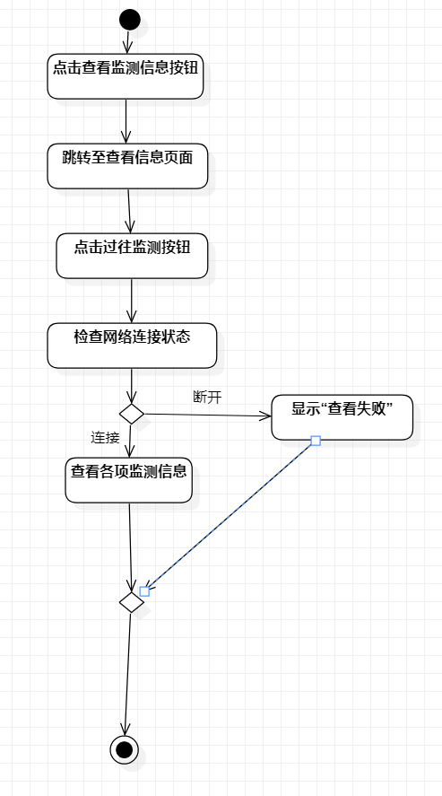
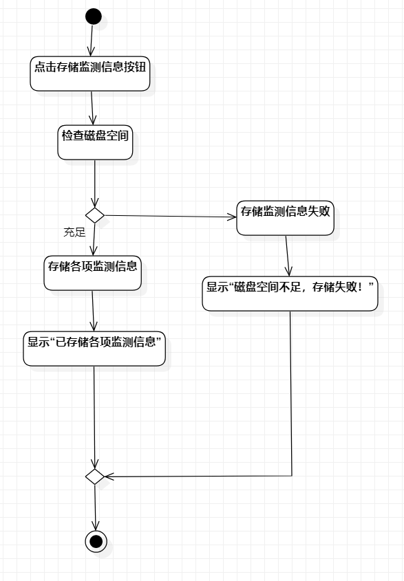
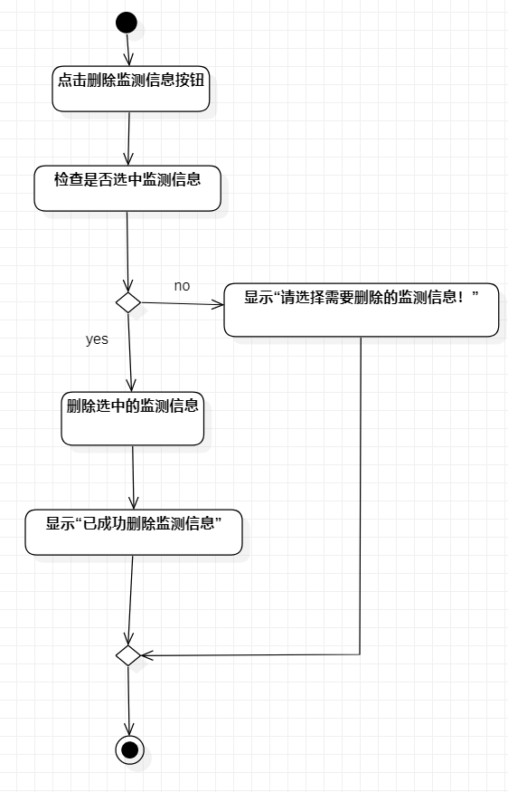

# 实验3 过程建模

## 实验目标

1.掌握过程建模方法

2.掌握活动图的画法

## 实验内容

1.使用StarUML绘制三个活动图

2.编写lab3.md

## 实验步骤

1.再次熟悉自己的选题及实验2的用例规约

2.使用StarUML绘制三个活动图
- 查看监测信息活动图
- 存储监测信息活动图
- 删除监测信息活动图

3.编写实验3的实验文档并检查

## 实验结果

图1：查看监测信息活动图

图2：存储监测信息活动图

图3：删除监测信息活动图
