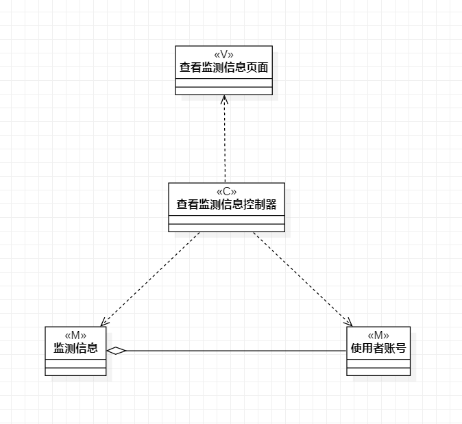
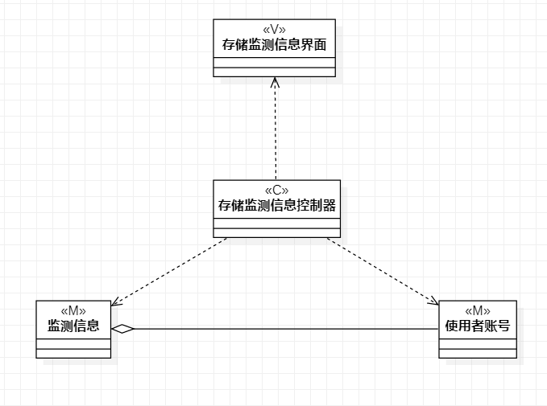
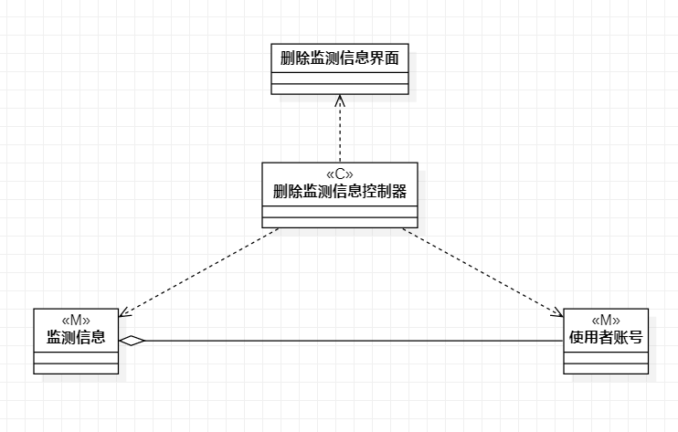

# 实验4-5

## 一、实验目标
1. 掌握类建模方法

2. 了解MVC或您熟悉的设计模式

3. 掌握类图的画法。（类图）

## 二、实验内容
1. 基于MVC模式设计类

2. 设计类的关系

3. 画出类图

## 三、实验步骤
1. 确定设计模式，选择MVC模式

2. 投射类图

- 确定模型层（Model）：根据用例涉及的数据设计模型类

- 确定控制器层（Controller）：根据用例中实现界面与数据层之间交互的方法设计控制器类

- 确定视图层（视图）：根据用例中使用到的界面设计界面类

- 确定类之间的关系

3. 检查类图及类之间的关系，确定以模型中的类能实现用例功能。

## 四、实验结果

图1：查看监测信息类图

图2：存储监测信息类图

图3：删除监测信息类图

