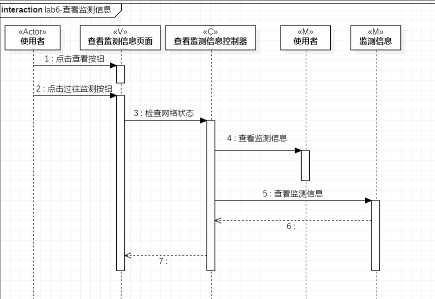
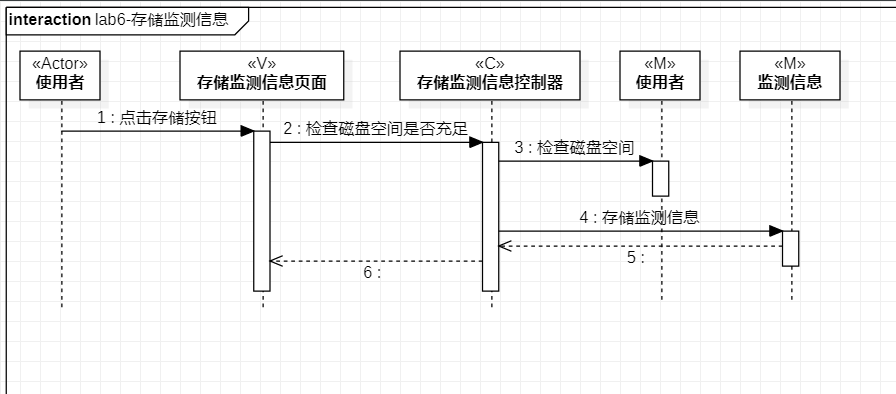
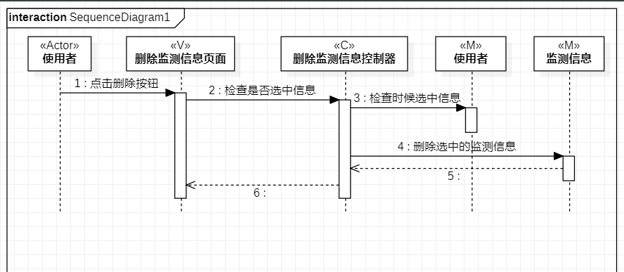

# 实验6：交互建模

## 一：实验目标

1. 理解系统互动。

2. 了解对象的概。

3. 掌握UML顺序图的画法。

4. 掌握对象互动的定义与建模方法。

# 二：实验内容

1. 根据用例模型和类模型，确定功能所涉及的系统对象。

- 查看监测信息顺序图

- 存储监测信息顺序图

- 删除监测信息顺序图

2. 在顺序图上画出参与者（对象）。

3. 在顺序图上画出消息（相互作用）。

4. 在顺序图上画出存活条（从上到下）。

5. 在顺序图上画出时间（从上到下）。

# 三：实验步骤

1. 在StarUml中创建顺序图：1.查看监测信息2.存储监测信息3.删除监测信息。

2. 从用例规约中的寻找参与者。

3. 根据类绘图寻找类。

4. 根据活动图投射消息，存活条和顺序。

- 消息：画在存活条上，从上到下代表时间顺序。

- 返回：从上到下代表时间顺序。

# 四：实验结果

1.查看监测信息顺序图

2.存储监测信息顺序图

3.存储监测信息顺序图

