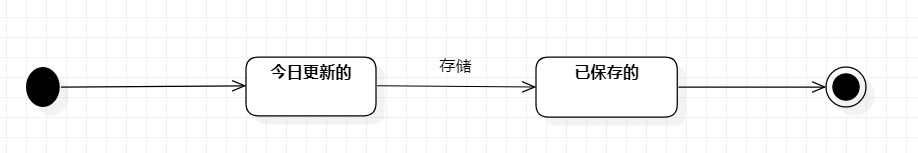

# 实验7：状态建模

## 一、实验目标

1. 掌握对象状态建模（状态图，Statechart）。

## 二、实验内容

1. 寻找一个关键的对象。

2. 设计该对象的关键状态。

3. 设计该对象的转变条件。

## 三、实验步骤

1. 根据自己的用例图，用例规约，活动图，类图，顺序图，选择“监测信息”作为关键的对象；

2. 发现“监测信息”的相关状态（今日更新的，已保存的（今日），已保存的（往日）），
“监测信息”的开始状态为今日更新的，保存后，“监测信息”的状态转变成已保存的（今日），
而最终状态则是已保存的（往日的）、

3. 添加“初始状态”，“最终状态”，“简单状态”，然后用连线连起来

## 实验结果

图1. 监测信息状态图

