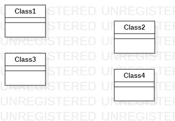

# UML实验一

## 1、实验目标
1.1、熟悉GitHub实验过程

1.2、安装与使用StarUML
## 2、实验内容
2.1、安装GitHub并练习实验Git Bash

2.2、安装StarUML并创建一个图
## 3、实验步骤
3.1、下载git工具和StarUML软件并安装

3.2、在GitHub上fork项目到账户下

3.3、克隆项目到本地磁盘

3.4、创建实验报文档，并用StarUML软件画第一张UML图，导出成为图片

3.5、Push到自己GitHub仓库中

3.6、PullRequest，请求文件合并到主仓库
## 4、实验结果
4.1、画图

图1.在StarUML上创建的第一张图
