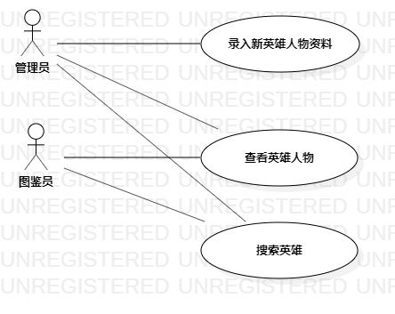

# UML实验二：用例建模

## 1、实验目标
1.1、用Markdown编写实验报告

1.2、细化选题功能需求

1.3、学习使用StarUML用例建模
## 2、实验内容
2.1、创建用例图

2.2、编写实验报告文档

2.3、编写用例规约
## 3、实验步骤
3.1、issue选题为：英雄图鉴系统

3.2、根据选题在StarUML上创建用例图

3.3、确定参与者（Actor）：

        - 管理员
        
        - 图鉴员
3.4、确定用例（UserCase）：

        - 录入新英雄人物资料
        
        - 搜索英雄
3.5、建立Actor和UserCase之间的联系

3.6、导出用例图为图片（lab2model0）

3.7、pull本地磁盘文件和Push到自己GitHub仓库中

3.8、编写实验报告和用例规约
## 4、实验结果
4.1、画图

图1.英雄图鉴系统的用例图

## 表1：录入新英雄人物资料用例规约  

用例编号  | UC01 | 备注  
-|:-|-  
用例名称  | 录入新英雄人物资料  |   
前置条件  |  管理员登录进入英雄图鉴系统   | *可选*   
后置条件  |   管理员进入录入新英雄人物资料页面     | *可选*   
基本流程  | 1. 管理员点击录入新英雄人物资料按钮；  |*用例执行成功的步骤*    
~| 2. 系统显示新英雄人物资料录入页面；  |   
~| 3. 管理员导入新英雄人物图片、填写新英雄人物名称和基本信息，点击录入按钮；  |   
~| 4. 系统查询新英雄人物信息，检查未存在相同英雄人物，保存新英雄人物资料；  |   
~| 5. 系统显示英雄人物总览首页。  |  
扩展流程  | 4.1 系统检查发现新英雄人物资料已经存在，提示管理员“该英雄已经存在”。 |*用例执行失败*    

## 表2：搜索英雄用例规约  

用例编号  | UC02 | 备注  
-|:-|-  
用例名称  | 搜索英雄  |   
前置条件  | 管理员或图鉴员登录进入英雄图鉴系统    | *可选*   
后置条件  |  管理员或图鉴员进入英雄搜索页面   | *可选*   
基本流程  | 1. 管理员或图鉴员点击搜索按钮；  |*用例执行成功的步骤*  
~| 2. 系统显示搜索页面；  |   
~| 3. 管理员或图鉴员输入搜索关键词，点击搜索按钮；  |   
~| 4. 系统检查关键字不为空，搜索英雄； |    
~| 5. 系统显示所搜索的英雄页面。 |    
扩展流程  | 4.1 系统检查关键字为空，提示“搜索不能为空”。  |*用例执行失败* 
