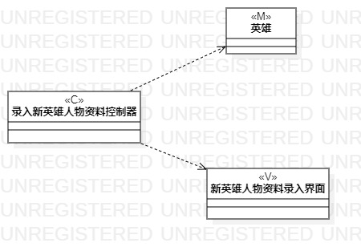
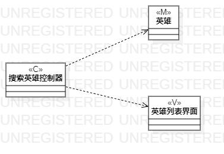

# UML实验四：类建模

## 1、实验目标
1.1、掌握类建模方法

1.2、了解MVC或熟悉的设计模式

1.3、掌握类图的画法（Class Diagram）

1.4、理解类的5种关系
## 2、实验内容
2.1、基于MVC模式设计类

2.2、根据实验二中的用例规约创建类图
## 3、实验步骤
3.1、在StarUML上创建 录入新英雄人物资料和搜索英雄 类图

3.2、根据MVC创建model类“英雄”，control类“录入新英雄人物资料控制器”和“搜索英雄控制器”，view类“新英雄人物资料录入界面”和“英雄列表界面”

3.3、给MVC三种类添加依赖关系

3.4、调整各部分位置，保持图简洁美观

3.5、导出活动图为图片（lab4model1、lab4model2）

3.6、pull本地磁盘文件和Push到自己GitHub仓库中

3.7、编写实验报告
## 4、实验结果

图1.录入新英雄人物资料图

图2.搜索英雄图
