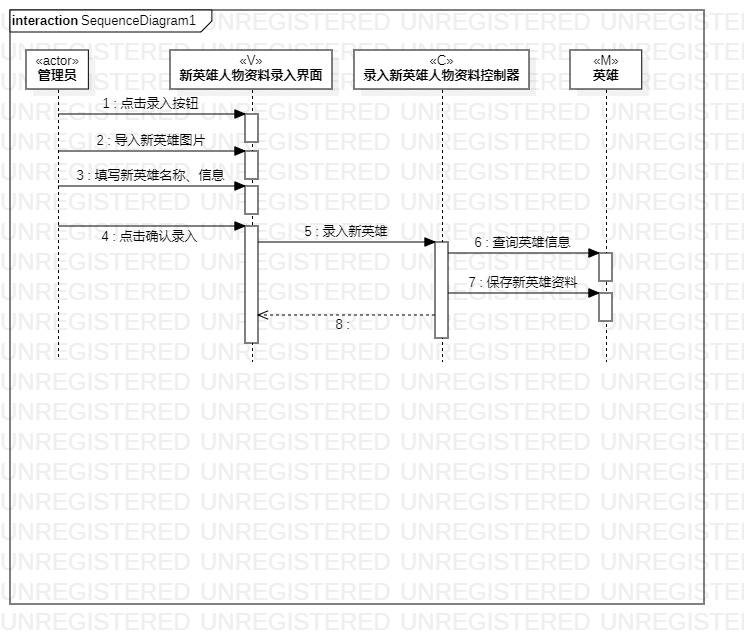
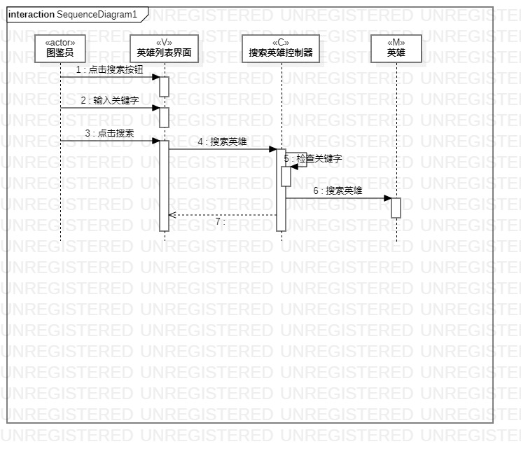

# UML实验六：交互建模

## 1、实验目标
1.1、理解系统交互

1.2、掌握UML顺序图的画法

1.3、掌握对象交互的定义与建模方法
## 2、实验内容
2.1、根据用例模型和类模型，确定功能所涉及的系统对象

2.2、在顺序图上画出参与者（对象）

2.3、在顺序图上画出消息（交互）
## 3、实验步骤
3.1、在StarUML上创建 录入新英雄人物资料和搜索英雄 顺序图

3.2、添加对象

3.3、画出对象之间的交互

3.4、调整各部分位置，保持图简洁美观

3.5、导出活动图为图片（lab6model1、lab6model2）

3.6、pull本地磁盘文件和Push到自己GitHub仓库中

3.7、编写实验报告
## 4、实验结果

图1.录入新英雄人物资料图

图2.搜索英雄图
