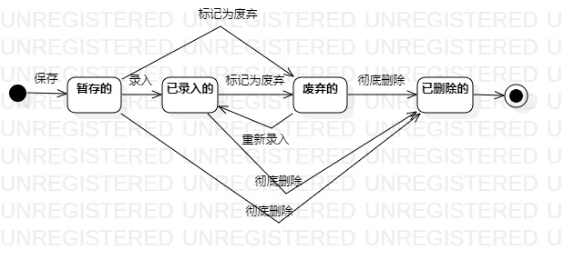

# UML实验七：状态建模

## 1、实验目标
1.1、掌握对象状态建模（状态图，Statechart）
## 2、实验内容
2.1、观看B站教学视频

2.2、根据用例图、活动图、类图、时序图来绘画状态图
## 3、实验步骤
3.1、在StarUML上创建 英雄状态图

3.2、寻找一个关键的对象（不拘泥于选择的功能，选择所建模软件系统中最重要的对象）

3.3、设计该对象的关键状态

3.4、设计状态之间的转变条件

3.5、导出状态图为图片（lab7model1）

3.6、pull本地磁盘文件和Push到自己GitHub仓库中

3.7、编写实验报告
## 4、实验结果

图1.英雄状态图
