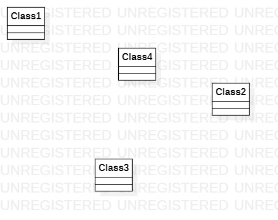

# 实验一

## 实验目标

- 熟悉GitHub实验过程
- 安装并使用StarUML

## 实验内容

- 安装GitHub并练习使用Git Bash
- 安装StarUML并创建第一个图

## 实验步骤

- 下载并安装Git和StarUML
- 将GitHub网站上个人库的代码clone到本地
- 使用StarUML创建第一个图
- 在GitHub网站上直接编辑md文档
- 提交请求到库

## 实验结果

- 画图

图1. 在StarUML上创建的第一个图
