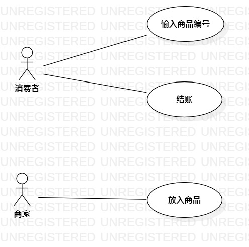

# 实验二：用例建模

## 实验目标

- 使用Markdown写报告
- 选题并用例建模

## 实验内容

- 修改实验一的实验报告
- 确定并提交选题
- 画用例图
- 提交实验二的实验报告

## 实验步骤

- 修改实验一的实验报告
- 提交选题：#279自动售货机系统
  - 该系统功能需求描述如下：
    - 消费者选择商品
    - 消费者结账
    - 系统弹出商品
- 画实验二用例图
  - 添加了一个参与者：消费者
  - 添加了两个用例：选择商品、结账
- 编写用例规约
- 提交报告

## 实验结果

图1. 自动售货机系统的用例图

## 表1：输入商品编号用例规约  

用例编号  | UC01 | 备注  
-|:-|-  
用例名称  | 选择商品  |   
前置条件  |      | *可选*   
后置条件  | 消费者进入结账界面     | *可选*   
基本流程  | 1. 消费者点击选择商品按钮；  |*用例执行成功的步骤*    
~| 2. 系统显示选择商品页面；  |   
~| 3. 消费者输入商品编号、商品数量，点击确认按钮；  |   
~| 4. 系统查询商品编号，检查商品编号相匹配的商品；  |   
~| 5. 系统显示结账界面。  |  
扩展流程  | 4.1 系统检查发现商品编号不存在，提示『找不到您所选择的商品，请确认该商品编号是否输入正确』；  |*用例执行失败*
~| 4.2 系统检查发现商品库存不足，提示『您选择的商品库存不足，请重新选择』。  |  

## 表2：结算费用用例规约  

用例编号  | UC02 | 备注  
-|:-|-  
用例名称  | 结账  |   
前置条件  | 消费者选择商品     | *可选*   
后置条件  | 系统显示交易成功界面     | *可选*   
基本流程  | 1. 消费者点击付费按钮；  |*用例执行成功的步骤*    
~| 2. 系统显示付费二维码；  |   
~| 3. 消费者扫描付费二维码，点击确定支付按钮，消费者账号扣除余额，保存支付信息；  |   
~| 4. 系统查询消费者支付信息，发现消费者成功付费，商家账号显示收款到账通知，保存收款信息；  |   
~| 5. 系统更新商品库存信息，弹出商品，显示交易成功界面。  |  
扩展流程  | 3.1 消费者检查发现账号余额不足，提示『账号余额不足，支付失败』；  |*用例执行失败*    
~| 4.1 系统在30秒内检查发现并无消费者支付信息，30秒后提示『请确认支付』；  |  

