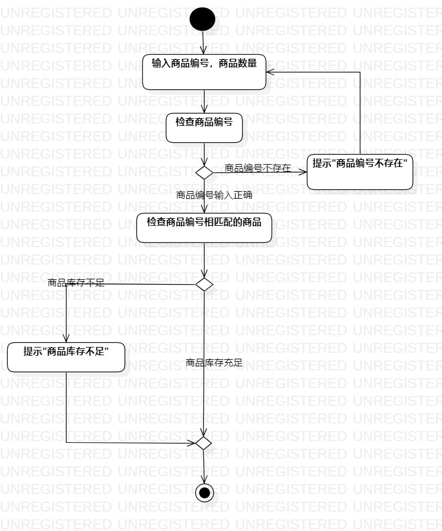
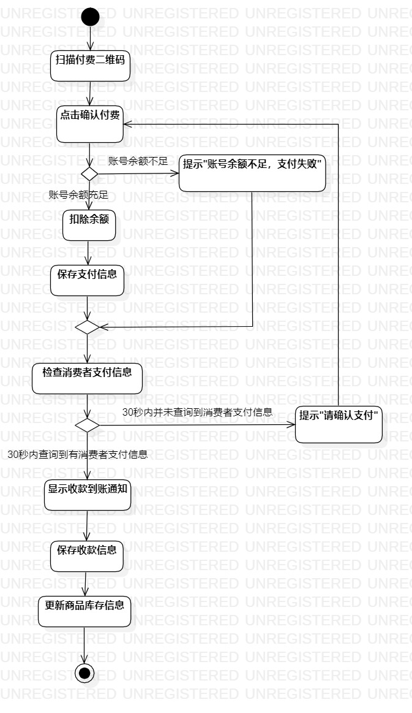

# 实验三：过程建模

## 实验目标

- 掌握过程建模方法
- 掌握活动图的画法（Activity Diagram）

## 实验内容

- 根据实验二中的用例规约绘制活动图

## 实验步骤

- 创建提交订单、结账的活动图
- 添加开始和终止结点
- 根据用例规约的基本流程和扩展流程来添加操作
- 在扩展流程处先使用分支，再合并
- 使用控制流连接
- 调整位置，使得活动图整洁易读

## 实验结果

图一：提交订单的活动图

图二：结账的活动图
