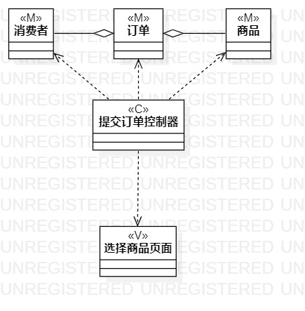
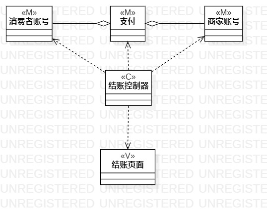

# 实验四五：类建模

## 实验目标

- 掌握类建模方法
- 了解MVC设计模式
- 掌握类图（Activity Diagram）的画法

## 实验内容

- 基于MVC模式设计类
- 画出类图

## 实验步骤

- 创建提交订单、结账的类图图
- 根据用例规约添加类
- 为每个类添加sterotype
- 建立类之间的关系
- 调整类图，使其简洁易读

## 实验结果

图一：提交订单的类图

图二：结账的类图
