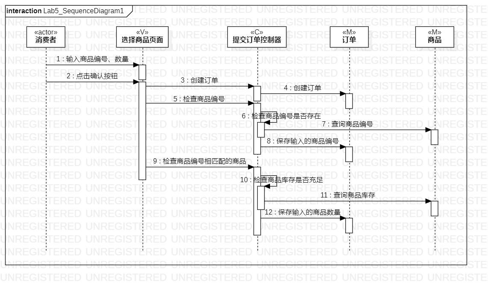
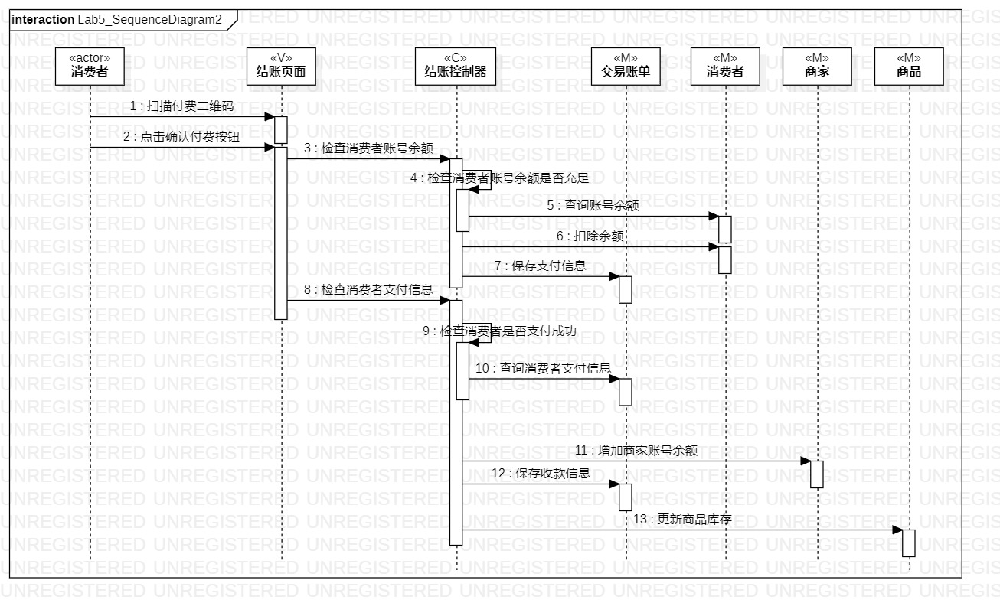

# 实验六：相互作用建模

## 实验目标

- 理解系统互动
- 掌握UML顺序图的画法
- 掌握对象互动的定义与建模方式

## 实验内容

- 根据活动图和类图确定功能所涉及的系统对象
- 绘制顺序图

## 实验步骤

- 学习顺序图的相关概念及画法
- 根据活动图和类图来添加对象
- 根据活动图和类图来添加对象
- 整理活动图，使其简洁易读

## 实验结果

图1. 提交订单的顺序图

图2. 结账的顺序图
