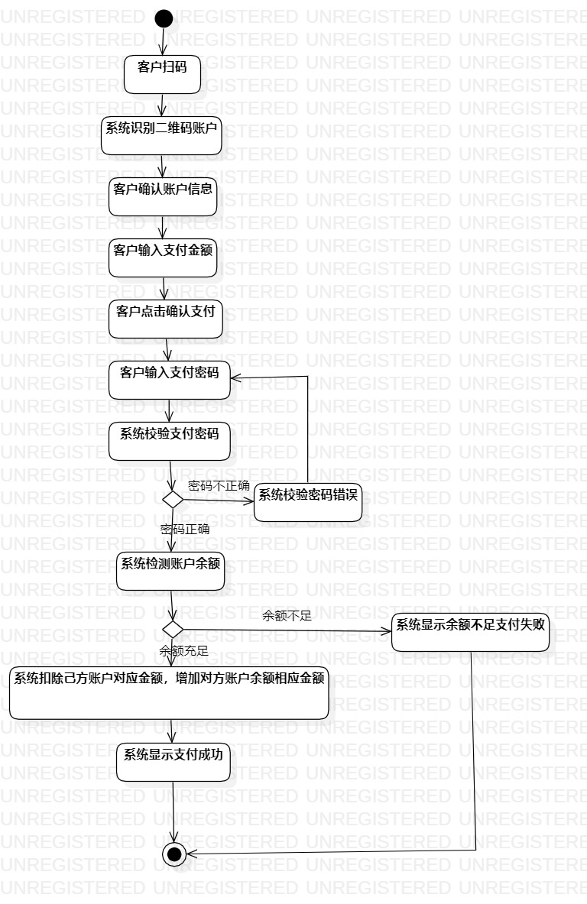
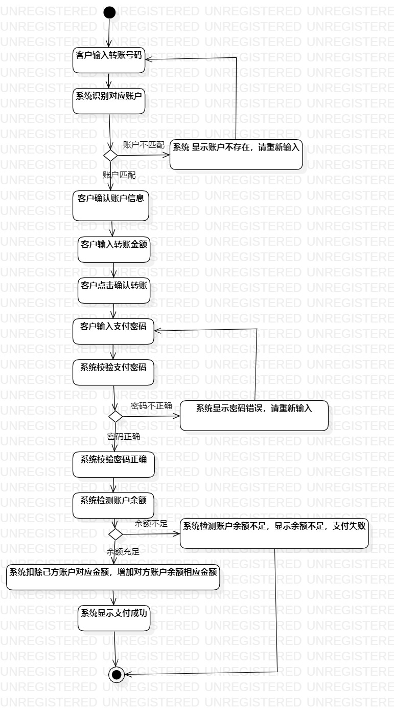

# 实验三：过程建模

## 1. 实验目标

- 掌握过程建模方法 
- 掌握过程图的画法 

## 2. 实验内容

- 画出用例图对应的过程图
 
## 3. 实验步骤

- 添加Activity Diagram
- 依据实验2的用例建模，添加Action，Merge，Decision，Final，Control Flow 

## 4. 实验结果
扫码支付过程图

 转账支付过程图 
 

