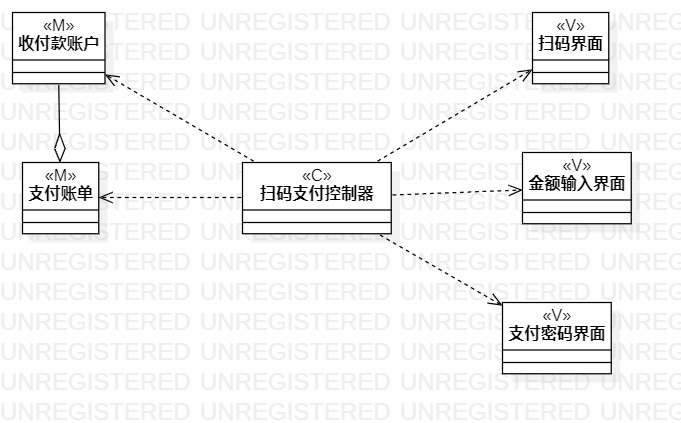
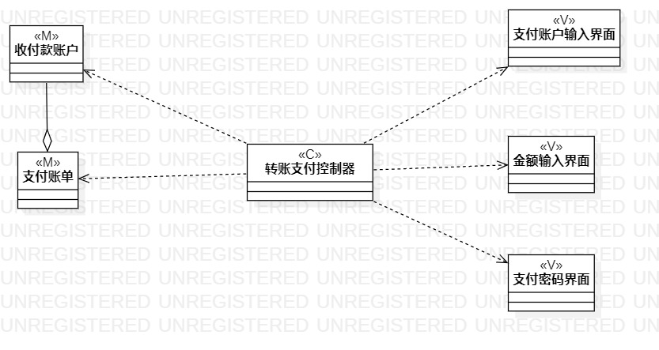

# 实验四/五：类建模

## 1. 实验目标

- 掌握类建模方法；
- 了解MVC的设计模式；
- 掌握类图的画法；
- 理解类的5种关系；
- 掌握类之间关系的画法。

## 2. 实验内容

- 基于MVC模式设计类；
- 设计类的关系；
- 画出类图。
 
## 3. 实验步骤

- 添加Class
- 根据类的关系进行连线  

## 4. 实验结果
扫码支付类图

 转账支付类图 
 

