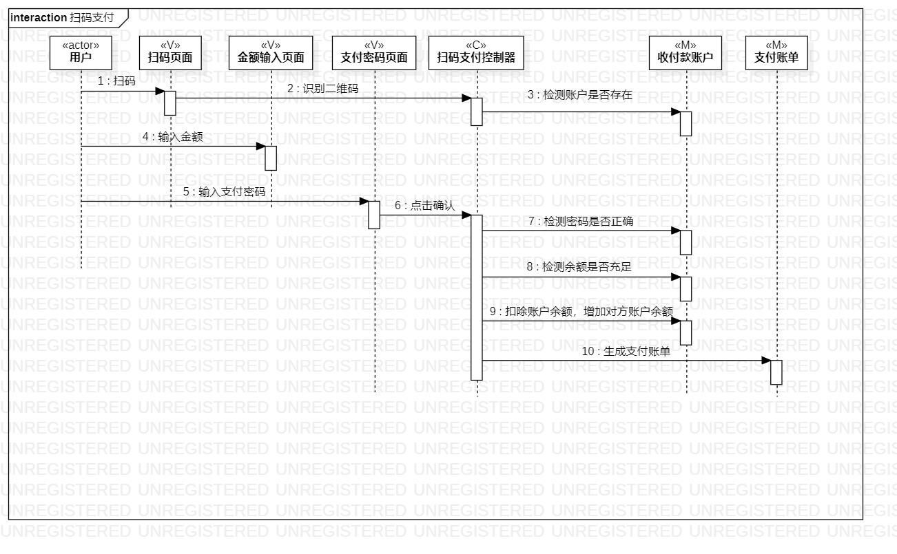
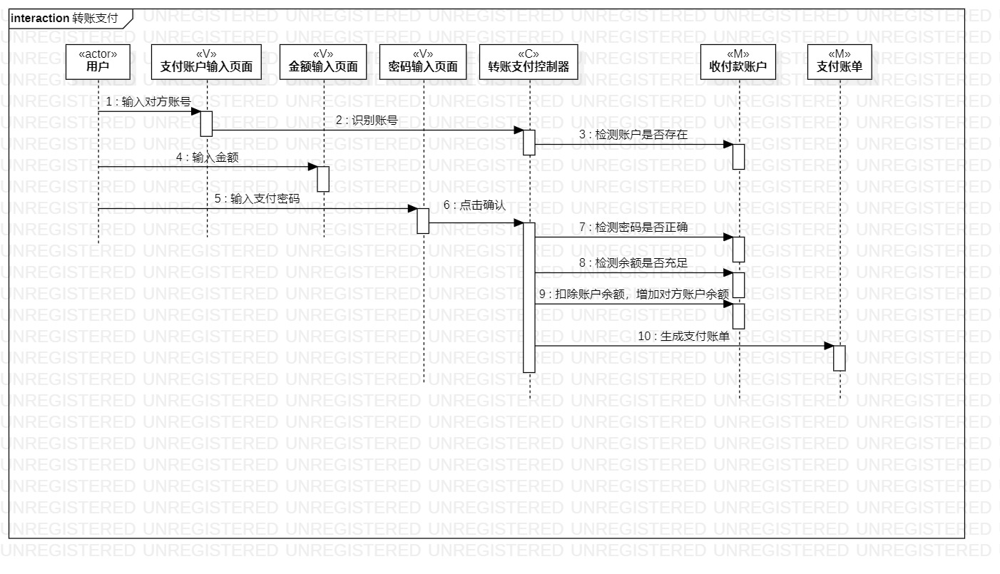

# 实验六：交互建模

## 1. 实验目标

- 理解系统交互；
- 掌握UML顺序图的画法；
- 掌握对象交互的定义与建模方法。

## 2. 实验内容

- 根据用例模型和类模型，确定功能所涉及的系统对象；
- 在顺序图上画出参与者（对象）；
- 在顺序图上画出消息（交互）。
 
## 3. 实验步骤

- 添加顺序图
- 按照活动图进行交互建模

## 4. 实验结果
扫码支付交互图

转账支付交互图

