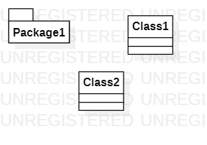

# 实验一

## 一、实验目标

1. 学习使用建模工具StartUML
2. 学习使用github进行实验的上传

## 二、实验内容

1. 安装Git，注册GitHub账号，Fork并Clone老师项目
2. 安装StartUML并画一张图
3. 编写实验报告

## 三、实验步骤

1. 下载并安装建模工具 StarUML，下载地址：http://staruml.io
2. 注册git个人账号，clone老师的主库
3. 确定个人建模选题，将选题填写在 Issues
4. 使用StartUML进行编辑第一张UML图
5. 编写文档，将本地的文档及UML图上传到个人账户的库下
6. 将实验内容pull request到老师账号

## 四、实验结果

1. 画图  
  
图1. StartUML创建第一张图