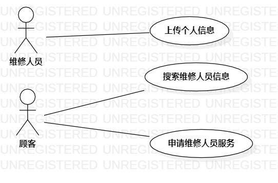

# 实验二

## 一、实验目标

1. 熟悉github的使用
2. 学会编写MarkDown格式的实验文档
3. 学会使用StartUML画图
4. 学习用例图的基本知识，掌握用例图的基本画法

## 二、实验内容

1. 确定、提交个人选题
2. 使用StartUML画选题用例图
3. 编写MarkDown格式的实验报告

## 三、实验步骤

1. 确定选题:上门维修服务平台，提交到Issue上。
2. 确定选题功能:  
    + 维修人员上传个人信息  
    + 顾客搜索维修人员  
    + 用户申请维修人员服务  
3. 确定选题后，利用所学的用例图知识，找出选题中的用例及参与者  
    + 参与者:
        + 维修人员  
        + 顾客  
    + 用例:  
        + 上传个人信息  
        + 搜索维修人员
        + 申请维修人员服务
4. 找到用例与参与者之间的关系，画成用例图

## 四、实验结果
1. 画图  
  
图1. 上门维修服务平台用例图

2. 用例规约

+ 表1：上传个人信息用例规约  

用例编号  | UC01 | 备注  
-|:-|-  
用例名称  | 上传个人信息  |   维修人员上传
前置条件  | 维修人员登录成功，进入个人信息输入界面   |    
后置条件  | 维修人员进入更新后的个人信息界面     |    
基本流程| 1. 维修人员输入个人信息，点击上传按钮   |   *用例执行成功的步骤*
~| 2. 系统检查输入信息符合规范，保存个人信息  |  
~| 3. 系统显示个人信息界面  |  
扩展流程  | 2.1 输入信息为空，提示“信息不可为空，重新输入”    |*用例执行失败*  
~| 2.2 输入信息含有违规词，提示“信息违规，重新输入”   |

+ 表2：搜索维修人员用例规约  

用例编号  | UC02 | 备注  
-|:-|-  
用例名称  | 搜索维修人员  |   顾客搜索维修人员信息
前置条件  | 顾客进入显示搜索框的搜索界面   |    
后置条件  |      |    
基本流程  |  1. 顾客输入搜索关键词，点击搜索按钮   |   *用例执行成功的步骤*
~| 2. 系统检查关键词，查找匹配关键词的维修人员信息  |  
~| 3. 系统显示搜索结果界面  |  
扩展流程  | 2.1 输入关键词为空，提示“关键词为空，重新输入”   |*用例执行失败*

+ 表3：申请维修人员服务用例规约  

用例编号  | UC03 | 备注  
-|:-|-  
用例名称  | 申请维修人员服务  |   
前置条件  | 顾客登录成功并进入维修人员信息界面   |    
后置条件  |      |    
基本流程  | 1. 顾客选择维修人员，点击申请按钮  |   *用例执行成功的步骤*
~| 2. 系统对比顾客与维修人员的信息，保存申请记录  |   
~| 3. 系统显示申请操作成功   |   
扩展流程  | 2.1 顾客地址与维修人员地址距离过远，申请失败，提示“不在服务范围，无法申请”  |*用例执行失败*
~| 2.2 顾客申请时间与维修人员服务时间不符，申请失败，提示“不在服务时间，无法申请” |