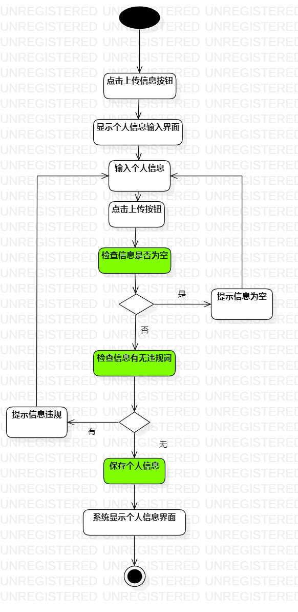
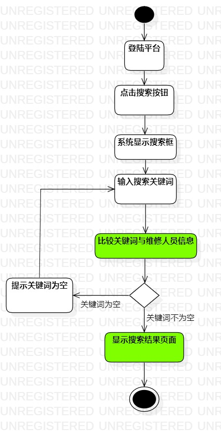
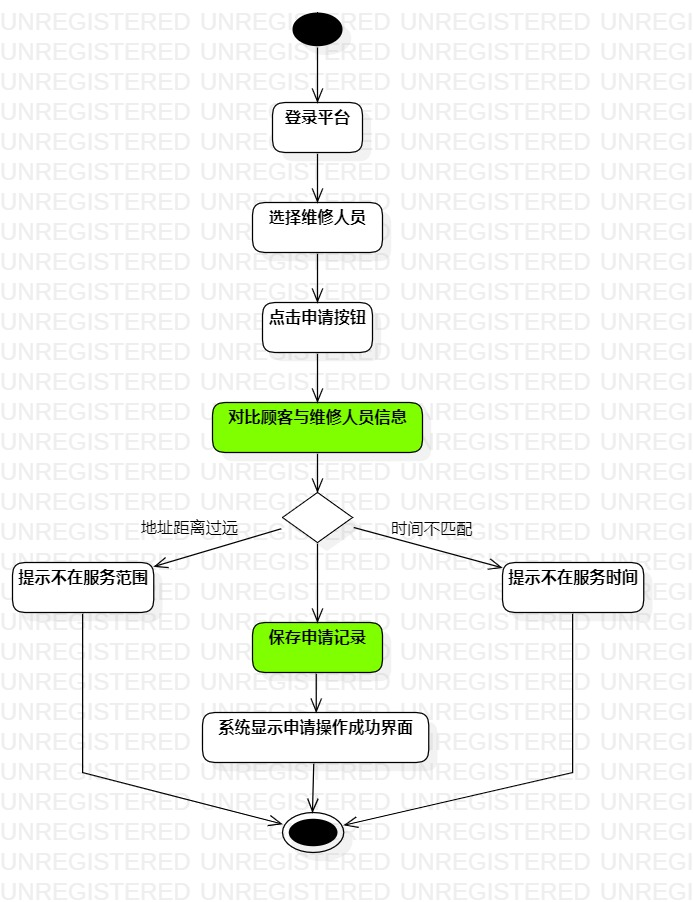

# 实验三

## 一、实验目标

1. 学习过程建模的概念
2. 了解过程建模的活动图概念及构成
3. 掌握活动图的基本画法

## 二、实验内容

- 根据用例规约绘制相应活动图

## 三、实验步骤

1. 在StartUML新建活动图
2. 添加初始结点、结束结点  
3. 根据用例规约添加活动
4. 在分支处添加决策  
5. 用Control Flow连接活动、决策，调整线条

## 四、实验结果
1. 活动图1：  
  
图1. 上传个人信息活动图

2. 活动图2：  
  
图2. 搜索维修人员活动图

3. 活动图3：  
  
图3. 申请维修人员服务活动图