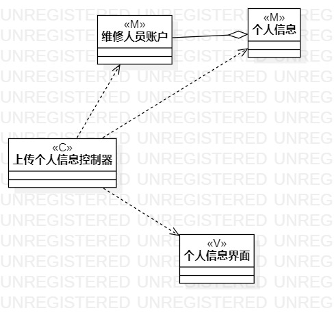
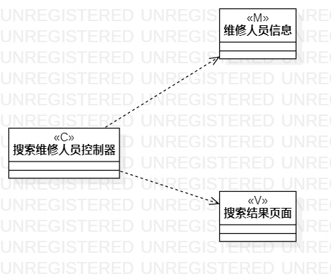
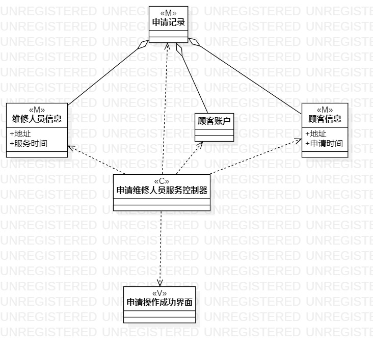

# 实验四、五

## 一、实验目标

1. 学习类建模的概念
2. 理解什么是类，学习类的五种关系
3. 学习MVC设计模式以及类图的基本画法

## 二、实验内容

1. 学习类及类图的概念
2. 依据MFC设计模式绘制类图
2. 记录学习到的知识，写成课程笔记

## 三、实验步骤

1. 观看老师发布的视频，了解类图画法以及MFC设计模式 
2. 打开StartUML新建类图
3. 以MFC设计模式设计类图：  
    - 找出用例中的model、view、control
    - 以Dependency连接control与mode、view
    - 找出mode内部联系，以Aggregation连接
4. 总结类图绘制经验，记录重要知识点

## 四、实验结果
1. 类图1：  
  
图1. 上传个人信息类图

2. 类图2：  
  
图2. 搜索维修人员类图

3. 类图3：  
  
图3. 申请维修人员服务类图

4. 课堂笔记
    1. 用例图：What to do？ 活动图：How to do？ 类图：Who do？
    2. 类描述包括两个方面：属性、操作
    3. UML类图画法为：矩形=名称+属性+操作
    4. 4种可见性的符号（按系统其他部分访问的难易程度排序，Public最易，Private最难）：
        - Public：+
        - Protected：#
        - Package：~
        - Private：-
    5. 类之间有五种关系，分别为（类关系从弱到强排列）：
        - Dependency（依赖）：两个相对独立对象，一个对象负责构造另一个对象的实例，或依赖另一个对象的服务；虚线箭头表示
        - Association（关联）：两个相对独立对象，一个对象的实例与另一个对象的一些特定实例存在固定的对应关系；实线箭头表示
        - Aggression（聚合）：一个类拥有但共享引用另一个类的对象；空心菱形+实线箭头表示
        - Composition（组合）：一个类包含另一个类的对象；用实心菱形+实线箭头表示
        - inheritance（继承）：一个类继承另一个类的功能，并可以增加自己的新功能；以空心三角形+实线表示
    6. MVC设计模式：Model、View、Control
        - Model和View无法互相访问
        - Control可以访问Model和View