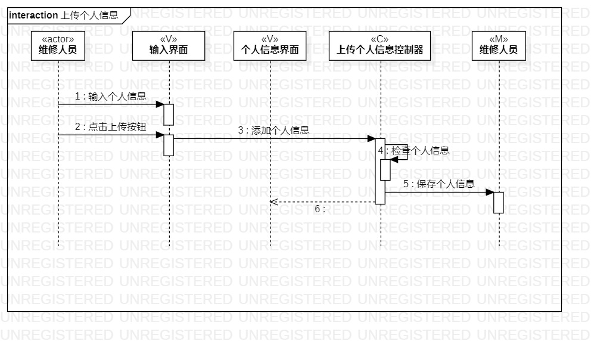
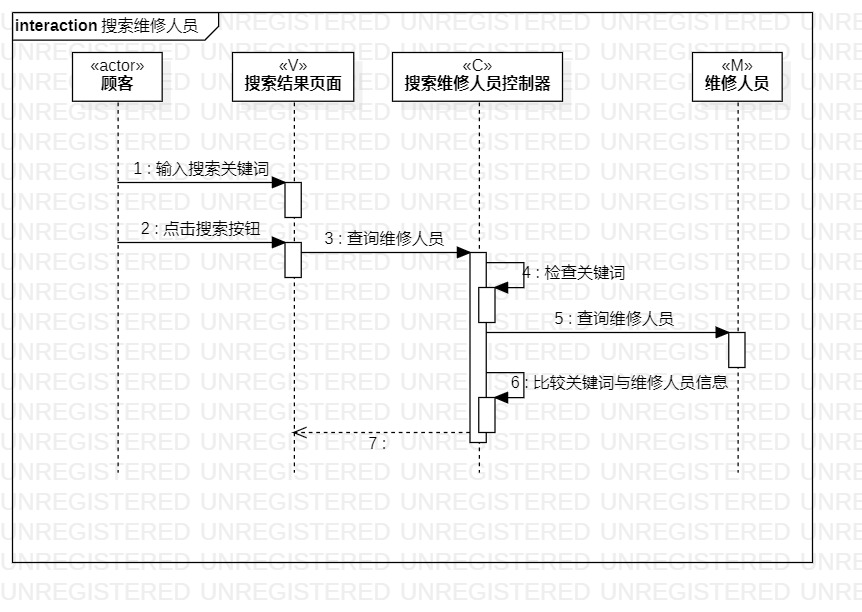
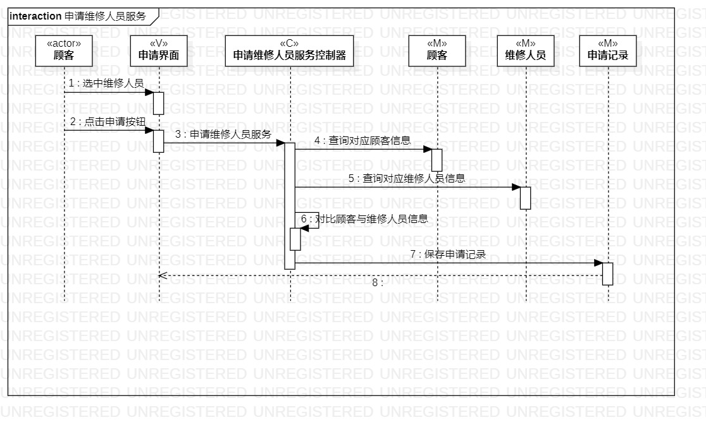

# 实验六

## 一、实验目标

1. 理解系统交互
2. 掌握对象交互建模及顺序图概念
3. 掌握顺序图的画法

## 二、实验内容

1. 学习对象交互建模的概念
2. 掌握顺序图的概念
3. 根据自己的课题画出顺序图
4. 记录学习到的知识，写成课程笔记

## 三、实验步骤

1. 观看老师发布的视频，了解对象交互建模以及顺序图的概念
2. 掌握顺序图的基本画法，打开StartUML创建顺序图
3. 从用例图找到第一个参与者，从类图找到多个参与者
4. 在活动图找到操作步骤，画出参与者之间的信息
5. 记录实验学习到的知识，整理成笔记记录在实验报告中

## 四、实验结果
1. 顺序图1：  
  
图1. 上传个人信息顺序图

2. 顺序图2：  
  
图2. 搜索维修人员顺序图

3. 顺序图3：  
  
图3. 申请维修人员服务顺序图

4. 课堂笔记
    1. 顺序图是强调消息时间顺序的交互图，解释了系统如何完成某个交互。
    2. 顺序图的主要构成：
        - 参与者：对象，用矩阵表示，对象是类的实例，首字母一般小写
        - 时间：交互发生的顺序，时间顺序是从上到下的，并且只表示先后顺序，不表示时间跨度
        - 事件、信号与消息：参与者之间的通信，相当于活动图中的操作，用带箭头的线表示
        - 存活条：显示了发送端和接收端，用参与者生命线上的矩阵表示
        - 消息的箭头：同步消息、异步消息、返回消息等