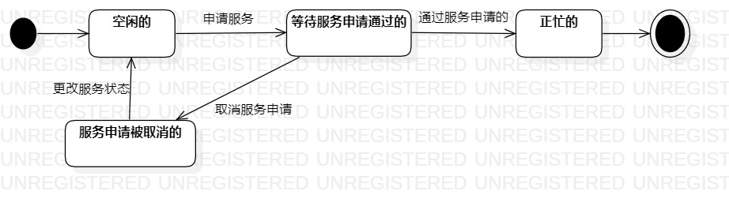

# 实验七

## 一、实验目标

1. 学习对象的状态
2. 掌握对象图概念及其画法

## 二、实验内容

1. 理解对象的概念并找到自己选题的主要对象
2. 设计该对象的关键状态
3. 找到并画出状态之间的转变条件
4. 画出该状态图

## 三、实验步骤

1. 观看老师发布的视频，了解状态建模以及状态图的概念
2. 找出选题中的主要对象：维修人员
3. 找到对象的关键状态：空闲的、等待服务申请通过的、正忙的的、服务申请被取消的
4. 找到状态之间的转变条件
5. 打开StartUML,根据上述找到的状态、转变条件等画出状态图

## 四、实验结果
1. 维修人员的状态图：  
  
图1. 维修人员的状态图