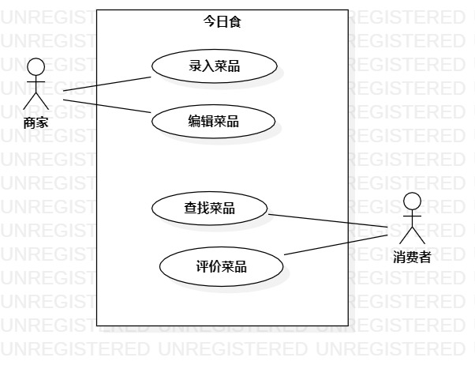

# 实验二

### 实验目标：
    1.确立自己的选题
    2.根据自己的选题,完成功能介绍
    3.根据自己的题目画出该题目的用例图
    

### 实验内容：
    1.首先在issue里提交自己的选题和功能介绍
    2.我的题目是#464 今日食咗未，功能是：
        1）商家录入菜单
        2）商家编辑菜单
        3）消费者查找菜单
        4）消费者评价菜单
    

### 实验结果

  
  
  
  
  
  图1.今日食咗未的用例图
