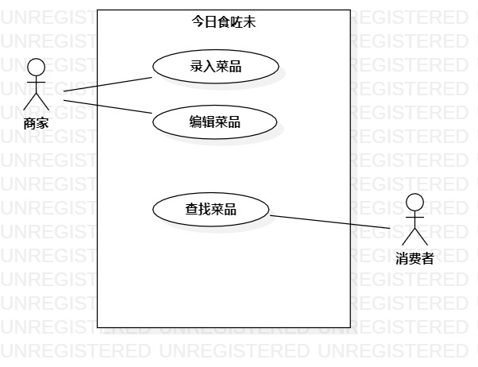

# 实验二

### 实验目标：
    1.确立自己的选题
    2.根据自己的选题,完成功能介绍
    3.根据自己的题目画出该题目的用例图
    

### 实验内容：
    1.首先在issue里提交自己的选题和功能介绍
    2.我的题目是#464 今日食咗未点菜系统，功能是：
        1）商家录入菜单
        2）商家编辑菜单
        3）消费者查找菜单
	3.并根据选题找出参与者与用例，并画出UML用例图提交，并编写实验报告提交
       
        
        
### 实验步骤：
    1.在GitHub的issues中发布自己的建模选题：#464 今日食咗未点菜系统
    2.找出建模选题中的用例和参与者
    3.在StarUML中画用例图，凭导出为图片jpg形式
    4.将图片git push在GitHub
    5.使用markdown编写实验报告，并提交实验报告

### 实验结果

  
  
  
  
  
  图1.今日食咗未点菜系统的用例图
